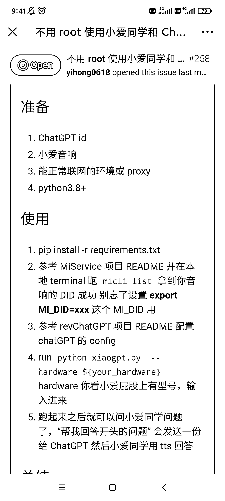
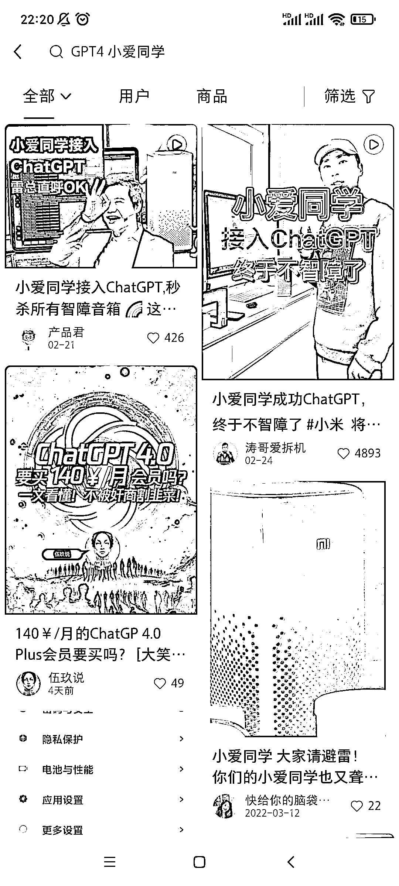
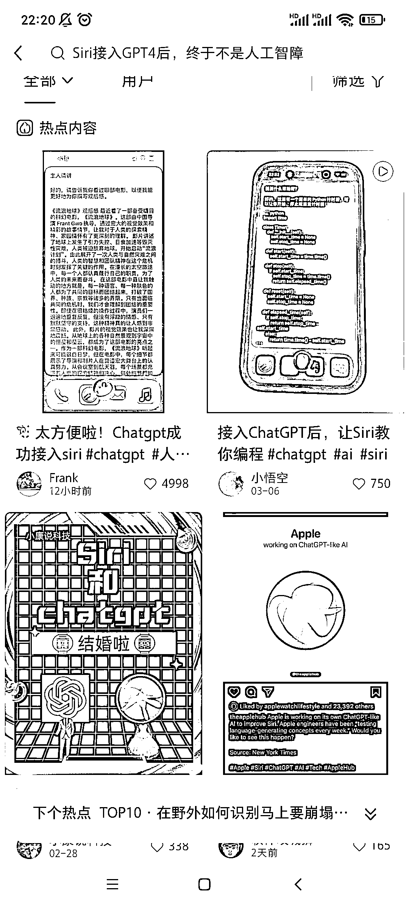

# 整合 ChatGPT 和小爱同学，SIRI 等语音助手交互的操作

> 原文：[`www.yuque.com/for_lazy/xkrm14/pfpch56rz6l7il1v`](https://www.yuque.com/for_lazy/xkrm14/pfpch56rz6l7il1v)

<ne-p id="u60c1f440" data-lake-id="u60c1f440"><ne-text id="ua214d17e">作者： 阿黎</ne-text></ne-p> <ne-p id="uffa1bd9b" data-lake-id="uffa1bd9b"><ne-text id="ubc9136ad">日期：2023-03-20</ne-text></ne-p> <ne-p id="uda928e07" data-lake-id="uda928e07"><ne-text id="uca63e50f">点赞数：</ne-text><ne-text id="ua5e3b285" ne-bold="true">16</ne-text></ne-p> <ne-hole id="u4ec9d61a" data-lake-id="u4ec9d61a"><ne-card data-card-name="hr" data-card-type="block" id="ozeGC" data-event-boundary="card"><ne-p id="u9e4d3359" data-lake-id="u9e4d3359"><ne-text id="u180db3b5">正文：</ne-text></ne-p> <ne-p id="u0e4ffee1" data-lake-id="u0e4ffee1"><ne-text id="u057d4c4e">整合 chatGPT 和小爱同学，SIRI 等 语音助手交互的操作，然后到淘宝闲鱼上，卖教程或者代操作，也可以做为引流资料，引流到 chatgpt 社群 图 3</ne-text> <ne-text id="ua805ae12">周日晚刷到，Siri 接入 ChatGPT4 话题，小红书上热度在增长</ne-text> [<ne-text id="uf351389e">不用+root+使用小爱同学和+ChatGPT+交互折腾记+·+Issue+#258+·+yihon...</ne-text>](https://github.com/yihong0618/gitblog/issues/258)</ne-p> <ne-p id="u11b592cc" data-lake-id="u11b592cc"><ne-card data-card-name="image" data-card-type="inline" id="aRWXP" data-event-boundary="card">  <ne-p id="u106d2283" data-lake-id="u106d2283"><ne-card data-card-name="image" data-card-type="inline" id="BpACb" data-event-boundary="card"></ne-card></ne-p> <ne-p id="ue59b8174" data-lake-id="ue59b8174"><ne-card data-card-name="image" data-card-type="inline" id="g2Xjf" data-event-boundary="card">  <ne-p id="u4a403a1d" data-lake-id="u4a403a1d"><ne-card data-card-name="image" data-card-type="inline" id="cZJqk" data-event-boundary="card">  <ne-hole id="u4de94f14" data-lake-id="u4de94f14"><ne-card data-card-name="hr" data-card-type="block" id="HBKKY" data-event-boundary="card"><ne-p id="u161f6045" data-lake-id="u161f6045"><ne-text id="u32003f8c">评论区：</ne-text></ne-p> <ne-p id="u19a16a37" data-lake-id="u19a16a37"><ne-text id="u5e266e8c">HEXIN : 周末就想要这么个东西</ne-text></ne-p> <ne-hole id="u7fe07d91" data-lake-id="u7fe07d91"><ne-card data-card-name="hr" data-card-type="block" id="rtIrG" data-event-boundary="card"><ne-p id="u85649952" data-lake-id="u85649952"><ne-text id="u086494be">公众号懒人找资源，懒人专属群分享</ne-text></ne-p></ne-card></ne-hole></ne-card></ne-hole></ne-card></ne-p></ne-card></ne-p></ne-card></ne-p></ne-card></ne-hole>