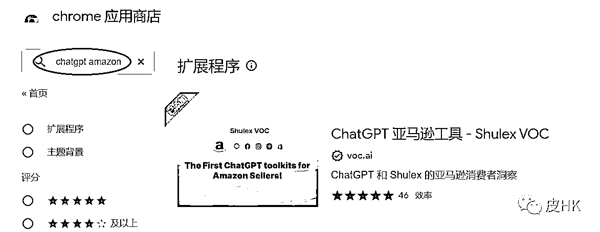
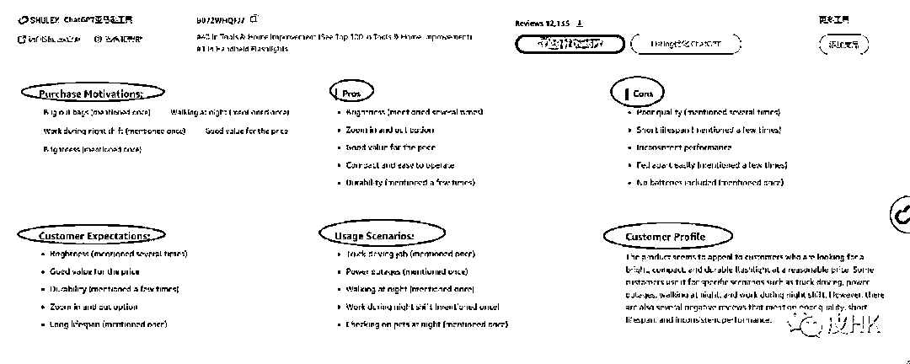

# ChatGPT 针对亚马逊卖家开发出一个谷歌插件 Shulex

> 原文：[`www.yuque.com/for_lazy/xkrm14/xspuygi37f0whwe5`](https://www.yuque.com/for_lazy/xkrm14/xspuygi37f0whwe5)

作者： 良辰美

日期：2023-03-20

点赞数：10

<ne-card data-card-name="hr" data-card-type="block" id="Nd0hT" data-event-boundary="card">

正文：

chatgpt 针对亚马逊卖家，有公司开发出一个谷歌插件特别好，名字是 shulex 收费 99$一个月，是做亚马逊产品链接的评论和 QA ，VOC 分析

<ne-card data-card-name="image" data-card-type="inline" id="jkewz" data-event-boundary="card">  <ne-p id="u7c8dd7f0" data-lake-id="u7c8dd7f0"><ne-card data-card-name="image" data-card-type="inline" id="Tn8x2" data-event-boundary="card">  <ne-card data-card-name="hr" data-card-type="block" id="vRMZi" data-event-boundary="card"><ne-p id="u1e83db95" data-lake-id="u1e83db95">评论区：

暂无评论

<ne-card data-card-name="hr" data-card-type="block" id="UBqWI" data-event-boundary="card">

公众号懒人找资源，懒人专属群分享

</ne-card></ne-card></ne-card></ne-p></ne-card></ne-p></ne-card>