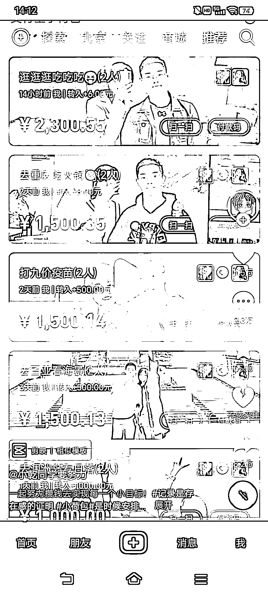
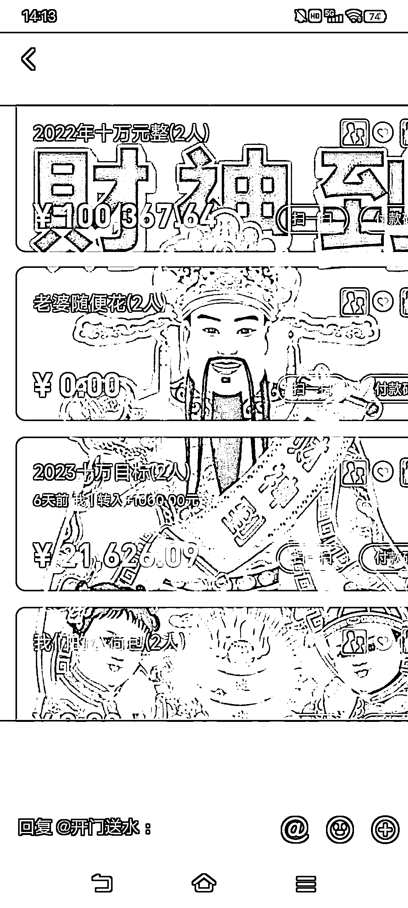

# 抖音推广，分目标情侣共同攒钱小程序

> 原文：[`www.yuque.com/for_lazy/xkrm14/wxp7sluqtnkwnbst`](https://www.yuque.com/for_lazy/xkrm14/wxp7sluqtnkwnbst)

<ne-p id="u7dece39f" data-lake-id="u7dece39f"><ne-text id="u06dfe603">作者： 仙蒂瑞珏</ne-text></ne-p> <ne-p id="uc8516a8d" data-lake-id="uc8516a8d"><ne-text id="u6bd538b8">日期：2023-03-22</ne-text></ne-p> <ne-p id="u958596b2" data-lake-id="u958596b2"><ne-text id="uaa817143">点赞数：</ne-text><ne-text id="ua84018c8" ne-bold="true">43</ne-text></ne-p> <ne-hole id="u767a12aa" data-lake-id="u767a12aa"><ne-card data-card-name="hr" data-card-type="block" id="YNI1g" data-event-boundary="card"><ne-p id="ud08c59f6" data-lake-id="ud08c59f6"><ne-text id="ufb4e7524">正文：</ne-text></ne-p> <ne-p id="u52e97c64" data-lake-id="u52e97c64"><ne-text id="u1d2afa6e">分目标情侣共同攒钱小程序 小荷包</ne-text></ne-p> <ne-p id="u67db14f3" data-lake-id="u67db14f3"><ne-card data-card-name="image" data-card-type="inline" id="pbHMt" data-event-boundary="card"></ne-card></ne-p> <ne-p id="u2e7078f3" data-lake-id="u2e7078f3"><ne-card data-card-name="image" data-card-type="inline" id="AtntW" data-event-boundary="card"></ne-card></ne-p> <ne-hole id="uf1b740bf" data-lake-id="uf1b740bf"><ne-card data-card-name="hr" data-card-type="block" id="Hzg0t" data-event-boundary="card"><ne-p id="u50a80d9d" data-lake-id="u50a80d9d"><ne-text id="uf3e4515b">评论区：</ne-text></ne-p> <ne-p id="u151cad4e" data-lake-id="u151cad4e"><ne-text id="u34e538eb">刘卡卡 : 支付宝有个小荷包，功能类似</ne-text></ne-p> <ne-p id="ude9cbb76" data-lake-id="ude9cbb76"><ne-text id="u91a595d7">虎虎生威 : 还有个 APP 叫恋爱记也是搞这个的，我都用过🌝</ne-text></ne-p> <ne-hole id="u3cd952bd" data-lake-id="u3cd952bd"><ne-card data-card-name="hr" data-card-type="block" id="vyOHd" data-event-boundary="card"><ne-p id="u7f2642ee" data-lake-id="u7f2642ee"><ne-text id="u5b2b6630">公众号懒人找资源，懒人专属群分享</ne-text></ne-p></ne-card></ne-hole></ne-card></ne-hole></ne-card></ne-hole>