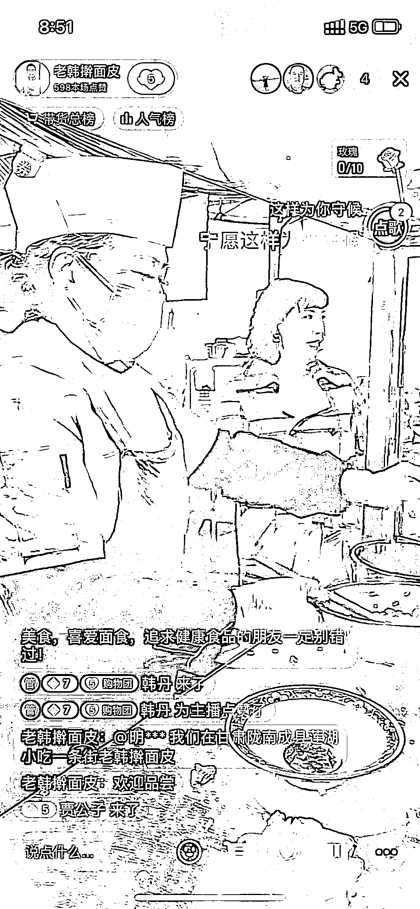

# 抖音地方特色可以做无成本直播

> 原文：[`www.yuque.com/for_lazy/xkrm14/pg6zrc4p3pweahoo`](https://www.yuque.com/for_lazy/xkrm14/pg6zrc4p3pweahoo)

作者： 韩丹

日期：2023-03-22

点赞数：47

正文：

这是我妈，她在甘肃小县城卖擀面皮卖了快三十年了，算是小县城的 top1。当然，对抖音等一窍不通。 过年回家，我给她说一定打开直播间，教了她步骤：就这样捡漏，每天还能开几单。 机会：很多小地方有做了很久的特色美食，且有一定知名度的。跟他们谈合作，只要不要让他们觉得麻烦，还有收入，应该能成。 然后花一两天调试下，就成了无成本直播（他们出货，出直播，反正就是双赢），我们只用管理下抖店后台，有时候还能卖其他货呢。

  

评论区：

暂无评论

公众号懒人找资源，懒人专属群分享

