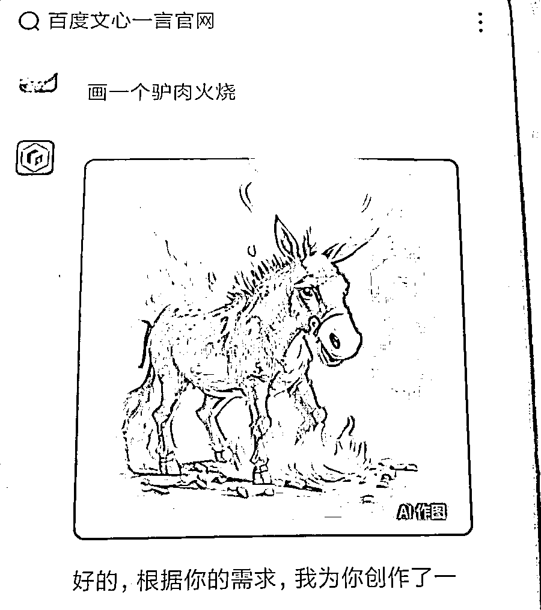
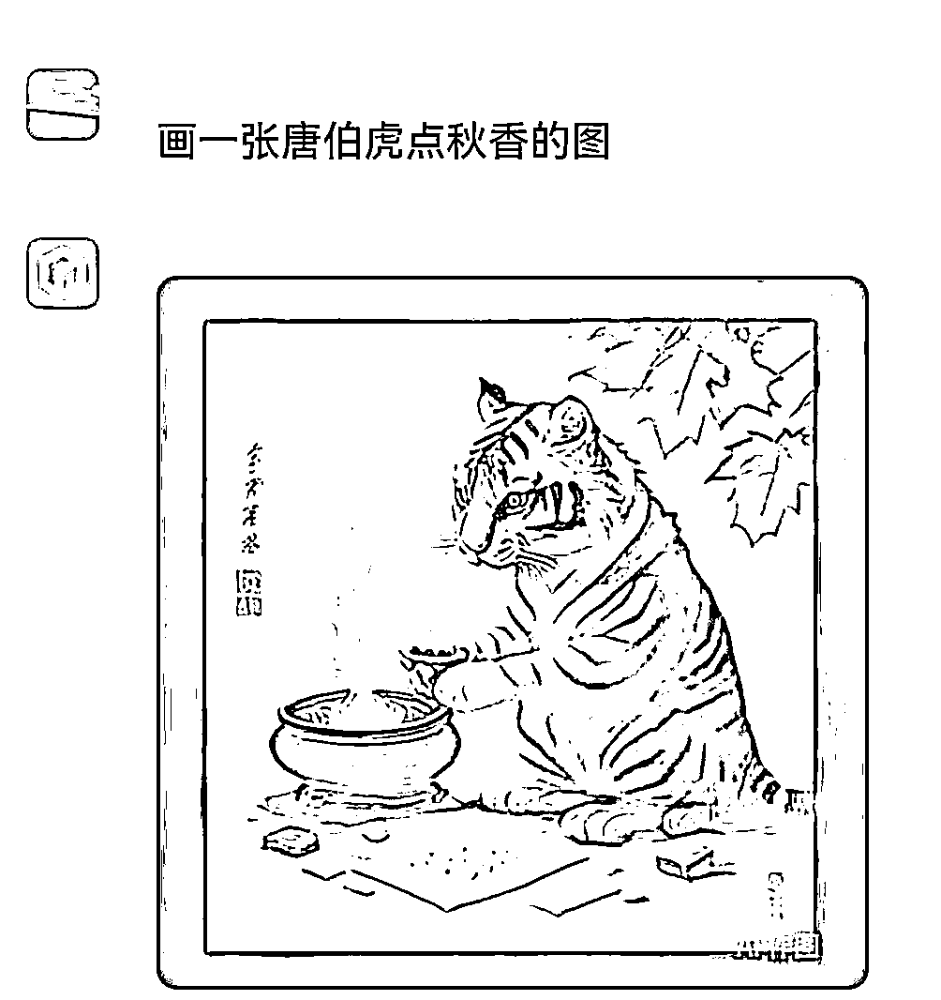

# 抖音吐槽百度文心出的图，自带喜感可引流

> 原文：[`www.yuque.com/for_lazy/xkrm14/tdsul7uthldqcxg8`](https://www.yuque.com/for_lazy/xkrm14/tdsul7uthldqcxg8)

<ne-p id="uba5890cc" data-lake-id="uba5890cc"><ne-text id="u4b0c3ba1">作者： 石头</ne-text></ne-p> <ne-p id="u19e02b14" data-lake-id="u19e02b14"><ne-text id="u89af144b">日期：2023-03-21</ne-text></ne-p> <ne-p id="u0114e296" data-lake-id="u0114e296"><ne-text id="u30222f80">点赞数：</ne-text><ne-text id="u77c40be7" ne-bold="true">23</ne-text></ne-p> <ne-hole id="u1179bd35" data-lake-id="u1179bd35"><ne-card data-card-name="hr" data-card-type="block" id="asaOW" data-event-boundary="card"><ne-p id="ud5ca56e6" data-lake-id="ud5ca56e6"><ne-text id="u3cfbab23">正文：</ne-text></ne-p> <ne-p id="ufa0cd967" data-lake-id="ufa0cd967"><ne-text id="u9da3c37e">百度文心出的图，目前自带喜感，可以出个系列的图，然后可以很快拉动评论量，在抖音去播，流量不错，带小游戏 cps</ne-text></ne-p> <ne-p id="u2ea67005" data-lake-id="u2ea67005"><ne-card data-card-name="image" data-card-type="inline" id="rpb6b" data-event-boundary="card">  <ne-p id="ud3b93c3f" data-lake-id="ud3b93c3f"><ne-card data-card-name="image" data-card-type="inline" id="GhdQL" data-event-boundary="card">  <ne-p id="udb28953e" data-lake-id="udb28953e"><ne-card data-card-name="image" data-card-type="inline" id="aOMqO" data-event-boundary="card">  <ne-p id="ua2bd7561" data-lake-id="ua2bd7561"><ne-card data-card-name="image" data-card-type="inline" id="j2gSU" data-event-boundary="card"></ne-card></ne-p> <ne-hole id="u642c277f" data-lake-id="u642c277f"><ne-card data-card-name="hr" data-card-type="block" id="tAige" data-event-boundary="card"><ne-p id="uc9f3f147" data-lake-id="uc9f3f147"><ne-text id="u66115390">评论区：</ne-text></ne-p> <ne-p id="u857fa5fd" data-lake-id="u857fa5fd"><ne-text id="u400a57b5">爱吃鱼的猫 : 好搞笑，哈哈哈</ne-text></ne-p> <ne-p id="u15f8a10e" data-lake-id="u15f8a10e"><ne-text id="u9b51961f">石头 : 哈哈，是的，更多的可以继续发挥下呀</ne-text></ne-p> <ne-p id="u1af208ef" data-lake-id="u1af208ef"><ne-text id="ud0ba03ed">爪爪 : 脑洞好大[憨笑]</ne-text></ne-p> <ne-p id="ubdfaa572" data-lake-id="ubdfaa572"><ne-text id="u15d56c90">余笙 : 好像学会了或者说是 bug 修复了，生成不出来了[捂脸]</ne-text></ne-p> <ne-hole id="ua09dc945" data-lake-id="ua09dc945"><ne-card data-card-name="hr" data-card-type="block" id="VOEgs" data-event-boundary="card"><ne-p id="u55c59b2f" data-lake-id="u55c59b2f"><ne-text id="u2b84a4f1">公众号懒人找资源，懒人专属群分享</ne-text></ne-p></ne-card></ne-hole></ne-card></ne-hole></ne-card></ne-p></ne-card></ne-p></ne-card></ne-p></ne-card></ne-hole>