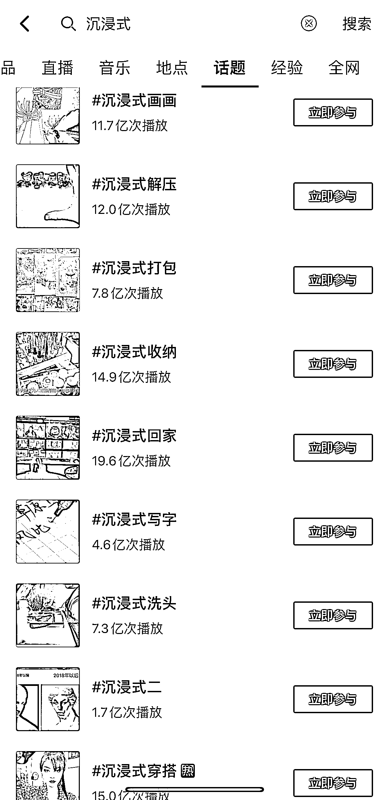

# 抖音上沉浸式 应用场景比较广 ，流量都不错

> 原文：[`www.yuque.com/for_lazy/xkrm14/yyi2h1h8mcckhel5`](https://www.yuque.com/for_lazy/xkrm14/yyi2h1h8mcckhel5)

作者： Jane

日期：2023-03-21

点赞数：25

正文：

表现手法参考：沉浸式 应用场景比较广 抖音上流量都不错

  

评论区：

暂无评论

公众号懒人找资源，懒人专属群分享

