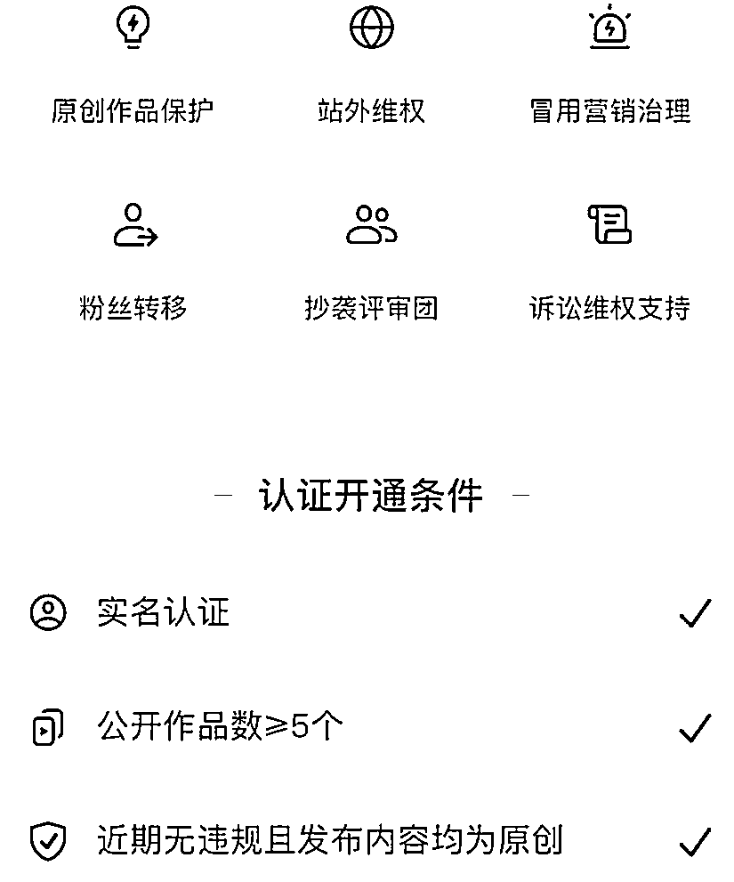

# 抖音原创保护升级，方便矩阵化

> 原文：[`www.yuque.com/for_lazy/xkrm14/md2h183axmiayaro`](https://www.yuque.com/for_lazy/xkrm14/md2h183axmiayaro)

作者： 月亮代表我的心

日期：2023-03-20

点赞数：29

<ne-hole id="u37a3d807" data-lake-id="u37a3d807"><ne-card data-card-name="hr" data-card-type="block" id="IGKdI" data-event-boundary="card">

正文：

抖音原创保护升级，方便矩阵化 1.搬运难度提升，原创更方便矩阵操作。 2.新功能：账号维权、粉丝转移，原创授权 3.粉丝转移：维权成功后可以把搬运粉丝获得的粉丝转移至原创账号。 4.原创认证：二创，剪辑视频只要满足条件也可以申请原创作者认证 5.授权搬运：可以授权 50 个小号，授权后方便方矩阵操作，不会被提示搬运和下架。

<ne-card data-card-name="image" data-card-type="inline" id="qI9bG" data-event-boundary="card">  <ne-hole id="u5d062e66" data-lake-id="u5d062e66"><ne-card data-card-name="hr" data-card-type="block" id="ZMCWc" data-event-boundary="card"><ne-p id="ubd461689" data-lake-id="ubd461689">评论区：

波叔 : 这个厉害了[强]

<ne-hole id="u724cd2a7" data-lake-id="u724cd2a7"><ne-card data-card-name="hr" data-card-type="block" id="M4q7O" data-event-boundary="card">

公众号懒人找资源，懒人专属群分享

</ne-card></ne-hole></ne-card></ne-hole></ne-card></ne-p></ne-card></ne-hole>