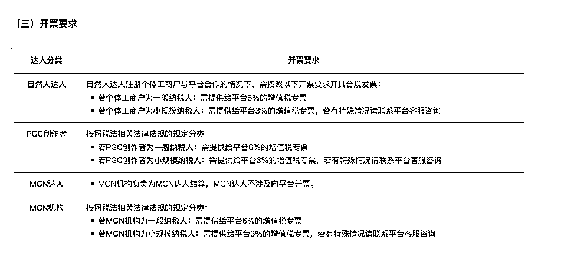

# 抖音对平台内达人以及 PGC 创作者任务合作收取平台服务费 5%

> 原文：[`www.yuque.com/for_lazy/xkrm14/avw2hz57800cy876`](https://www.yuque.com/for_lazy/xkrm14/avw2hz57800cy876)

作者： 郭郭

日期：2023-03-20

点赞数：10

正文：

【巨量星图】抖音对于平台内达人以及 PGC 创作者任务合作收取平台服务费 5%，达人需自己成立个体工商户且进行开票！ 合作 MCN 机构也需要支付平台 3%作为平台服务费，再由 MCN 支付给到达人结算 综合费率算下来：加上的增值税 6%，综合成本达到了 9 个点！ 【巨量星图】2023 年 4 月 3 日起，平台将对任务收益收取一定比例的平台技术服务费，请知悉！[巨量星图结算管理规则-星图营销服务平台](https://www.xingtu.cn/help-center/author/133057)

  

  

评论区：

暂无评论

公众号懒人找资源，懒人专属群分享

