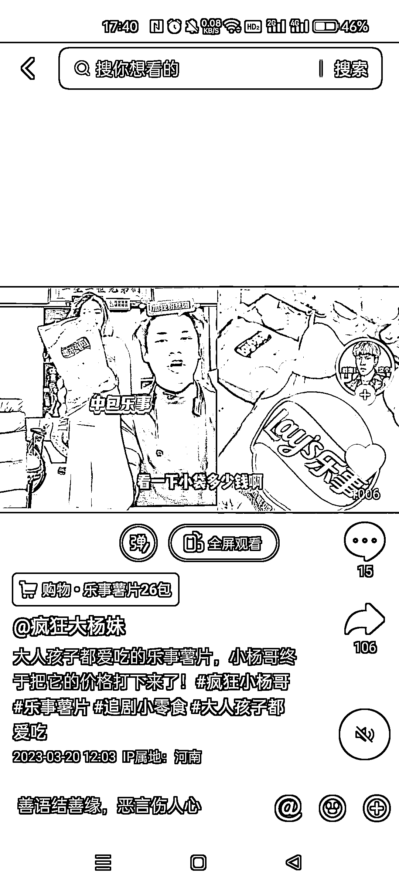
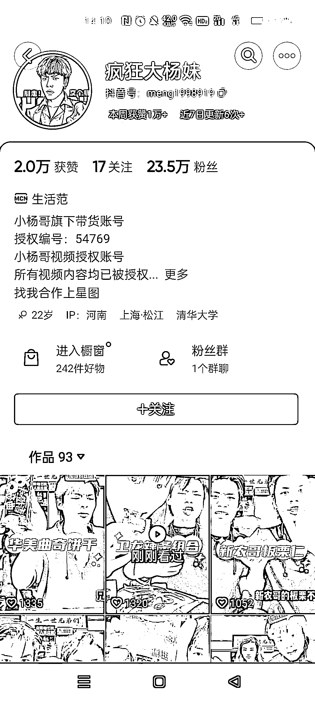

# 抖音直播视频和商品展示分屏展示，边去重边吸引用户下单

> 原文：[`www.yuque.com/for_lazy/xkrm14/pr7z67hd1rx068o0`](https://www.yuque.com/for_lazy/xkrm14/pr7z67hd1rx068o0)

作者： BOy 樱花雨落

日期：2023-03-20

点赞数：30

正文：

在抖音找到的一个带货账号，是小杨哥直播切片的，他是把直播视频和商品展示分屏展示，一方面去重，另一方面也是吸引用户下单。我去主页看了下，效果还挺好。点赞过千，96 个视频带货八千多单，平均下来一个视频就是九十单。而且流量很稳定，发布几个小时的都点赞过千了。

  

  

  

  

评论区：

平凡 : 这个思路好，完美解决了去重问题

亦然 : 感谢，已操作

爱米粒 : 这个绝了

罗松萍 : 这个授权？？是真是假

BOy 樱花雨落 : 真的，小杨哥的授权很容易获得

罗松萍 : 你好，我能请教一下怎么获取吗

公众号懒人找资源，懒人专属群分享

</ne-p></ne-p></ne-p></ne-p>