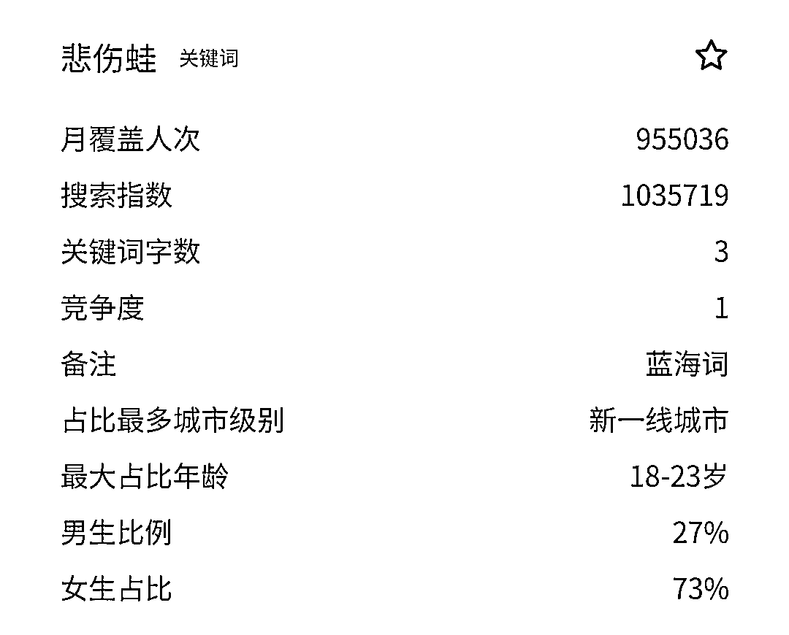
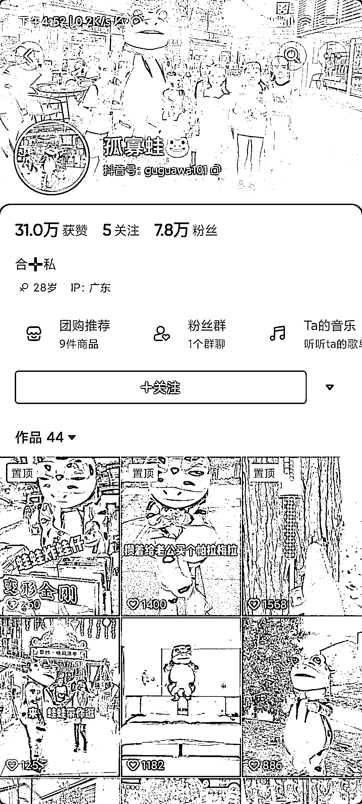

# 抖音穿玩偶服饰，做本地团购

> 原文：[`www.yuque.com/for_lazy/xkrm14/xpgi8mlefm7asofh`](https://www.yuque.com/for_lazy/xkrm14/xpgi8mlefm7asofh)

<ne-p id="u9a7f7f34" data-lake-id="u9a7f7f34"><ne-text id="u1b9405af">作者： 七小</ne-text></ne-p> <ne-p id="ua7582fa0" data-lake-id="ua7582fa0"><ne-text id="ueec78887">日期：2023-03-20</ne-text></ne-p> <ne-p id="ua8d54d17" data-lake-id="ua8d54d17"><ne-text id="u12d5a96a">点赞数：</ne-text><ne-text id="ud2a13edd" ne-bold="true">16</ne-text></ne-p> <ne-hole id="u716d8bf6" data-lake-id="u716d8bf6"><ne-card data-card-name="hr" data-card-type="block" id="jgpHA" data-event-boundary="card"><ne-p id="ub98052a1" data-lake-id="ub98052a1"><ne-text id="u57219aa3">正文：</ne-text></ne-p> <ne-p id="u22236240" data-lake-id="u22236240"><ne-text id="u5f71787b">1.翻到一个词【悲伤蛙】，搜索指数挺高，印象中这是个表情包青蛙？有点兴趣，去抖音搜一下。</ne-text> <ne-text id="u6fc5e804">2.翻了一下视频，看到一个账号，就是穿着悲伤蛙的玩偶装，来拍视频。最早的视频是 2022.11 月的，到现在 5 个月，有 7w 粉丝了</ne-text> <ne-text id="u34d73772">3.翻了一下橱窗，做的是本地生活团购 4.再去翻视频，看到一些佛山餐饮店的推广 理解了，思路就是： 穿知名的玩偶服出镜+搞笑/小故事视频+本地景点都逛一遍+</ne-text> <ne-text id="uc011ff37">橱窗挂同城团购的产品变现+接店铺视频推广变现。 我觉得这个玩法的成本不大，可以复制。</ne-text></ne-p> <ne-p id="uc50b7e39" data-lake-id="uc50b7e39"><ne-card data-card-name="image" data-card-type="inline" id="JDlyj" data-event-boundary="card">  <ne-p id="u6987b455" data-lake-id="u6987b455"><ne-card data-card-name="image" data-card-type="inline" id="r74uC" data-event-boundary="card">  <ne-p id="ufbec508f" data-lake-id="ufbec508f"><ne-card data-card-name="image" data-card-type="inline" id="FkrBK" data-event-boundary="card">  <ne-p id="u1b7c6e5a" data-lake-id="u1b7c6e5a"><ne-card data-card-name="image" data-card-type="inline" id="L7uqq" data-event-boundary="card">  <ne-p id="u0d7c8020" data-lake-id="u0d7c8020"><ne-card data-card-name="image" data-card-type="inline" id="Ft96K" data-event-boundary="card">  <ne-p id="u82dbd803" data-lake-id="u82dbd803"><ne-card data-card-name="image" data-card-type="inline" id="vOJRz" data-event-boundary="card">  <ne-hole id="ua60162ea" data-lake-id="ua60162ea"><ne-card data-card-name="hr" data-card-type="block" id="vYegG" data-event-boundary="card"><ne-p id="u556404fa" data-lake-id="u556404fa"><ne-text id="u854a8426">评论区：</ne-text></ne-p> <ne-p id="ua3b772f5" data-lake-id="ua3b772f5"><ne-text id="u1b4540e7">野生行家 : 今天在一个新店门口就看到了这只青蛙🐸</ne-text></ne-p> <ne-p id="u955ee498" data-lake-id="u955ee498"><ne-text id="uf1ab9105">孔孔孔孔孔. : 也有见到半夜穿着蛙蛙服装，在外面直播，引起同情</ne-text></ne-p> <ne-hole id="u8db46da3" data-lake-id="u8db46da3"><ne-card data-card-name="hr" data-card-type="block" id="aA30m" data-event-boundary="card"><ne-p id="ue511f16a" data-lake-id="ue511f16a"><ne-text id="u2ece71fe">公众号懒人找资源，懒人专属群分享</ne-text></ne-p></ne-card></ne-hole></ne-card></ne-hole></ne-card></ne-p></ne-card></ne-p></ne-card></ne-p></ne-card></ne-p></ne-card></ne-p></ne-card></ne-p></ne-card></ne-hole>