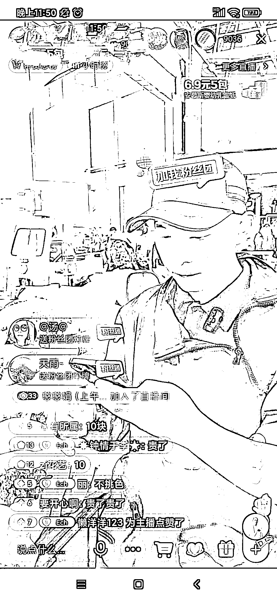
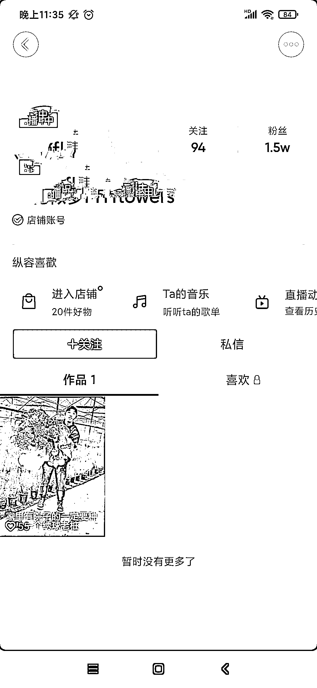

# 抖音批发市场直播卖鲜花热人气超高！

> 原文：[`www.yuque.com/for_lazy/xkrm14/cr12ktuzt5icd4ce`](https://www.yuque.com/for_lazy/xkrm14/cr12ktuzt5icd4ce)

<ne-p id="u98173ee6" data-lake-id="u98173ee6"><ne-text id="ucf2e6c19">作者： 成长快乐</ne-text></ne-p> <ne-p id="u6bb34099" data-lake-id="u6bb34099"><ne-text id="ua50e6183">日期：2023-03-20</ne-text></ne-p> <ne-p id="u4cde947f" data-lake-id="u4cde947f"><ne-text id="u8d15cc1a">点赞数：</ne-text><ne-text id="uf5c81629" ne-bold="true">18</ne-text></ne-p> <ne-hole id="u5ad69b87" data-lake-id="u5ad69b87"><ne-card data-card-name="hr" data-card-type="block" id="bJ1wK" data-event-boundary="card"><ne-p id="u19250d30" data-lake-id="u19250d30"><ne-text id="uee77ebcb">正文：</ne-text></ne-p> <ne-p id="u66f2c47a" data-lake-id="u66f2c47a"><ne-text id="u9eee33fa">去批发市场直播卖鲜花热人气超高！ 一天涨粉 3 万多人，第一天刷到时 1.5 万关注，第二天刷到都已经 4.8 万关注了。</ne-text> <ne-text id="ucff1c477">直播间摊位和老板谈价格把鲜花全部低价买下，然后直接说加 6 元快递费，2 元包装费，2 元人工费，在自己加 2 元，直接做链接发货！1 万人的直播间基本上上秒光。</ne-text> <ne-text id="u117f878f">这个生意感觉大家都可以模仿，不但有好的销量，直播间人气和关注都涨的超快！ 个人感觉这个形式很多类似的产品都可以借鉴！</ne-text></ne-p> <ne-p id="u4b1dd094" data-lake-id="u4b1dd094"><ne-card data-card-name="image" data-card-type="inline" id="mTzFx" data-event-boundary="card">  <ne-p id="ued86100c" data-lake-id="ued86100c"><ne-card data-card-name="image" data-card-type="inline" id="O64bL" data-event-boundary="card">  <ne-p id="ud6a6390b" data-lake-id="ud6a6390b"><ne-card data-card-name="image" data-card-type="inline" id="C7fja" data-event-boundary="card">  <ne-p id="u06c581d4" data-lake-id="u06c581d4"><ne-card data-card-name="image" data-card-type="inline" id="ZVNaP" data-event-boundary="card">  <ne-hole id="u1abad9a8" data-lake-id="u1abad9a8"><ne-card data-card-name="hr" data-card-type="block" id="CAU71" data-event-boundary="card"><ne-p id="ub16bd3f1" data-lake-id="ub16bd3f1"><ne-text id="uae5ab57c">评论区：</ne-text></ne-p> <ne-p id="ub84fb89d" data-lake-id="ub84fb89d"><ne-text id="u377c8170">韩小燕 : 目前在云南斗南花卉市场蛮多人在做这个的，我认识的一个人，做了一年了，月入 1 万+，每天晚上直播后还要清点打包邮寄，基本每天要弄到凌晨两点以后才能够睡觉</ne-text></ne-p> <ne-p id="u96228d18" data-lake-id="u96228d18"><ne-text id="u93c5877a">成长快乐 : 应该是没有掌握好技巧吧！这个主播一小时也不止 1w</ne-text></ne-p> <ne-p id="u58dd59de" data-lake-id="u58dd59de"><ne-text id="ude14c63c">韩小燕 : 嗯嗯，我研究下去~</ne-text></ne-p> <ne-p id="u06c9f757" data-lake-id="u06c9f757"><ne-text id="ub7b9184d">大江 : 是哪个账号，能说下吗？</ne-text></ne-p> <ne-p id="u5d84be19" data-lake-id="u5d84be19"><ne-text id="ud851f4ae">成长快乐 : 繁花似梦 Myflowers 应该在晚上 12 点后直播</ne-text></ne-p> <ne-p id="u1807a6f9" data-lake-id="u1807a6f9"><ne-text id="ucb698b02">大江 : 好的谢谢</ne-text></ne-p> <ne-p id="uf57160cb" data-lake-id="uf57160cb"><ne-text id="u2bfd5931">成长快乐 : 客气了</ne-text></ne-p> <ne-hole id="u78cefc1b" data-lake-id="u78cefc1b"><ne-card data-card-name="hr" data-card-type="block" id="wIaDh" data-event-boundary="card"><ne-p id="u68e55321" data-lake-id="u68e55321"><ne-text id="ubf21eb96">公众号懒人找资源，懒人专属群分享</ne-text></ne-p></ne-card></ne-hole></ne-card></ne-hole></ne-card></ne-p></ne-card></ne-p></ne-card></ne-p></ne-card></ne-p></ne-card></ne-hole>