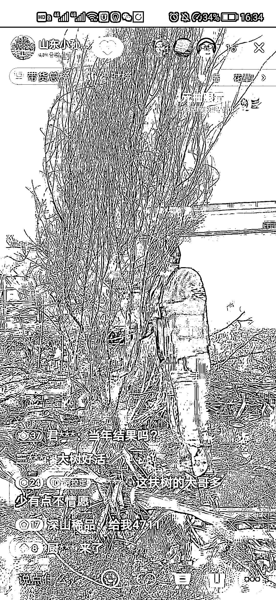

# 抖音做盆景老桩，价格翻几倍

> 原文：[`www.yuque.com/for_lazy/xkrm14/watbm2qav653s6xa`](https://www.yuque.com/for_lazy/xkrm14/watbm2qav653s6xa)

作者： 一登

日期：2023-03-20

点赞数：12

正文：

一颗树龄老了结果产量很低的老树在果农眼里不值钱，但是变个人群叫盆景老桩，价格翻几倍。最近看很多卖石榴老桩的。其实就是那些石榴水果树老了产量底或者土地到期了果树需要铲除，以极低的价格买过来，在卖老桩，光秃秃的一根就是一两千，如果是带造型带盆那就更贵了。石榴老桩也很有寓意。多子多福，红红火火

评论区：

暂无评论

公众号懒人找资源，懒人专属群分享

