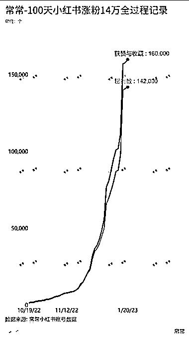
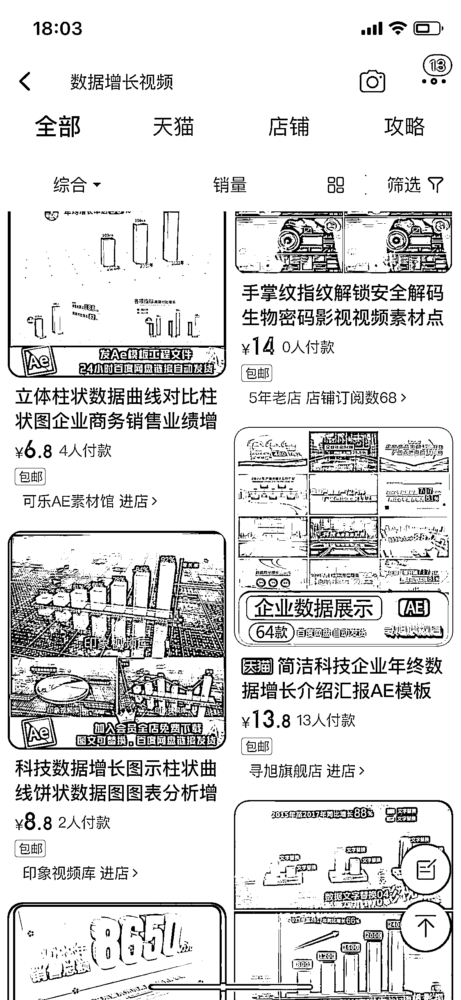
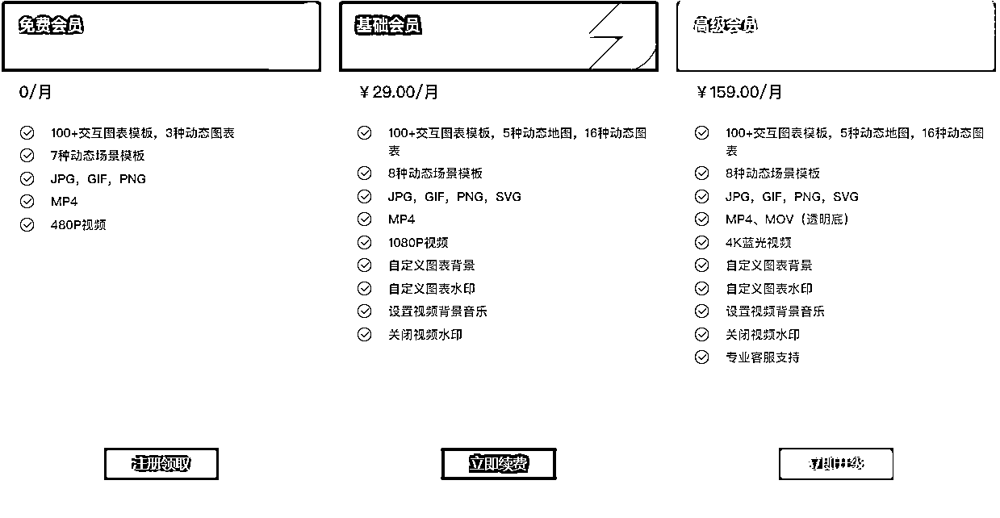

# 花火数图 Hanabi-在线数据短视频工具

> 原文：[`www.yuque.com/for_lazy/xkrm14/qvscz466mp1n4tuv`](https://www.yuque.com/for_lazy/xkrm14/qvscz466mp1n4tuv)

<ne-p id="u930bac8e" data-lake-id="u930bac8e"><ne-text id="u7421401a">作者： 常常</ne-text></ne-p> <ne-p id="u2b55d0ab" data-lake-id="u2b55d0ab"><ne-text id="u81e067e7">日期：2023-03-21</ne-text></ne-p> <ne-p id="ub5353720" data-lake-id="ub5353720"><ne-text id="u5fa7aae5">点赞数：</ne-text><ne-text id="u9b9cea9c" ne-bold="true">36</ne-text></ne-p> <ne-hole id="ubdf3b47c" data-lake-id="ubdf3b47c"><ne-card data-card-name="hr" data-card-type="block" id="RVUDs" data-event-boundary="card"><ne-p id="ue90eb20c" data-lake-id="ue90eb20c"><ne-text id="u6c573519">正文：</ne-text></ne-p> <ne-p id="u80de80cb" data-lake-id="u80de80cb"><ne-text id="ue04040f5">一款在线数据可视化制作神器推荐，四步完成数据动态图！ 分享一个非常棒的工具，实测证明确实可以套利</ne-text> <ne-text id="u29229d56">我在制作自己小红书粉丝数据随着时间增长变化时，发现想要制作一个视频，需要进行使用 AE 模板，</ne-text> <ne-text id="u7766bac1">在 B 站、小红书上搜索了很多办法，都没有一个可以直接输入数据，自动生成视频的模式</ne-text> <ne-text id="uecd89d13">后来想到了数据可视化的办法，终于找到了国内一家靠谱的网站，导入数据，一键生成数据视频： 花火数图</ne-text> <ne-text id="u8e7b5653">到了这一步，其实已经可以是一个生意了，在淘宝、闲鱼上帮助别人做动态的数据视频或者数据 GIF，自己不用模板，直接一键生成。 第二个价值点在于信息差的利用：</ne-text> <ne-text id="u02db3996">花火数图是一个专门做数据动态可视化的网站，提供了大量的数据可视化模板，可以直接使用，但是需要付费会员，会员价格还不便宜，如果只是使用一次很不方便，却付了几十元，多少有些麻烦。</ne-text> <ne-text id="u30b72be0">所以，在闲鱼上搜索，还真的找到了一些卖家，1.5 可以用 5 天，很划算，但是到付款时发现，这 5 天是好友邀请，只要你是用户，邀请一个新人，双方就可以互相收到 5 天的会员体验，真的是没想到生意还可以这么做，可以既得了便宜，又赚到了钱，</ne-text> <ne-text id="u978d7518">这是我心中把信息差用到极致的例子，没有之一，哈哈。</ne-text> <ne-text id="uf459e2ca">这个风向标最大的价值，除了给各位圈友提供一个工具，解决一个实际问题，还是想用这个例子给看到的圈友一个启发，其他的软件也可以使用同样的办法。</ne-text> [<ne-text id="u4c6e09d0">花火数图 Hanabi-在线数据短视频工具-数可视</ne-text>](https://hanabi.data-viz.cn/index?lang=zh-CN)</ne-p> <ne-p id="u1f7b1128" data-lake-id="u1f7b1128"><ne-card data-card-name="image" data-card-type="inline" id="UECZG" data-event-boundary="card"></ne-card></ne-p> <ne-p id="ua0ad1521" data-lake-id="ua0ad1521"><ne-card data-card-name="image" data-card-type="inline" id="kguy6" data-event-boundary="card"></ne-card></ne-p> <ne-p id="uef9795f5" data-lake-id="uef9795f5"><ne-card data-card-name="image" data-card-type="inline" id="eokjd" data-event-boundary="card"></ne-card></ne-p> <ne-p id="u072a1a07" data-lake-id="u072a1a07"><ne-card data-card-name="image" data-card-type="inline" id="Z9uVS" data-event-boundary="card"></ne-card></ne-p> <ne-p id="u90d2cbd1" data-lake-id="u90d2cbd1"><ne-card data-card-name="image" data-card-type="inline" id="WdXAq" data-event-boundary="card"></ne-card></ne-p> <ne-p id="u5e24cf5c" data-lake-id="u5e24cf5c"><ne-card data-card-name="image" data-card-type="inline" id="SHuJL" data-event-boundary="card"></ne-card></ne-p> <ne-hole id="uc3cdcaac" data-lake-id="uc3cdcaac"><ne-card data-card-name="hr" data-card-type="block" id="PSniQ" data-event-boundary="card"><ne-p id="u009001e7" data-lake-id="u009001e7"><ne-text id="ub66da074">评论区：</ne-text></ne-p> <ne-p id="u37e0367b" data-lake-id="u37e0367b"><ne-text id="u472afcb9">暂无评论</ne-text></ne-p> <ne-hole id="uc01c2217" data-lake-id="uc01c2217"><ne-card data-card-name="hr" data-card-type="block" id="kn35M" data-event-boundary="card"><ne-p id="u27b091d3" data-lake-id="u27b091d3"><ne-text id="u828fc889">公众号懒人找资源，懒人专属群分享</ne-text></ne-p></ne-card></ne-hole></ne-card></ne-hole></ne-card></ne-hole>