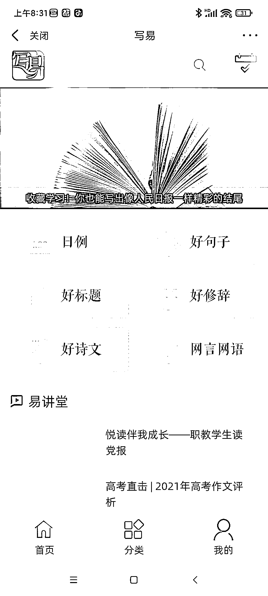
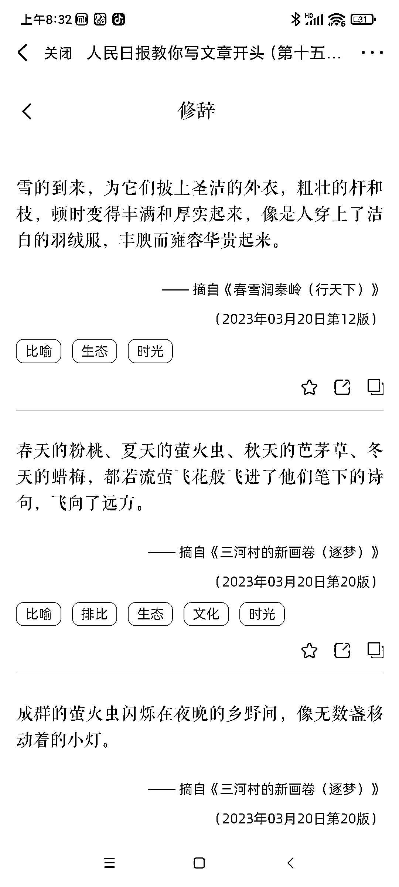
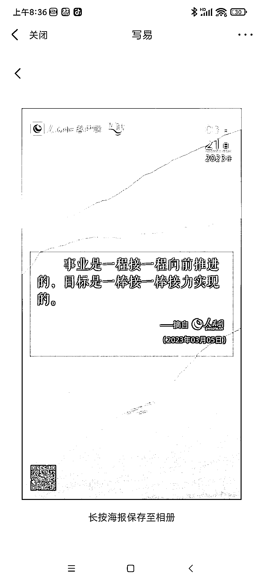

# 比较好的写文章的素材库可以参考一下，人民网+的 APP

> 原文：[`www.yuque.com/for_lazy/xkrm14/ud53vuhm3rh96sli`](https://www.yuque.com/for_lazy/xkrm14/ud53vuhm3rh96sli)

<ne-p id="u20bf1b31" data-lake-id="u20bf1b31"><ne-text id="ucb8fcc01">作者： 高建</ne-text></ne-p> <ne-p id="ud7ad40aa" data-lake-id="ud7ad40aa"><ne-text id="uaa4fc027">日期：2023-03-21</ne-text></ne-p> <ne-p id="uaa4a5550" data-lake-id="uaa4a5550"><ne-text id="u53dbf851">点赞数：</ne-text><ne-text id="ubbb7c00e" ne-bold="true">53</ne-text></ne-p> <ne-hole id="u7a1c22a6" data-lake-id="u7a1c22a6"><ne-card data-card-name="hr" data-card-type="block" id="RSl2l" data-event-boundary="card"><ne-p id="u722cffd3" data-lake-id="u722cffd3"><ne-text id="ue72854c2">正文：</ne-text></ne-p> <ne-p id="uc646e0a1" data-lake-id="uc646e0a1"><ne-text id="u03e1b51f">有个比较好的写文章的素材库可以参考一下。人民网+的 APP，有个学习写好文的专栏，点击好句可以看到原文章，还可以生成图片等。</ne-text></ne-p> <ne-p id="ud897979e" data-lake-id="ud897979e"><ne-card data-card-name="image" data-card-type="inline" id="AGr2T" data-event-boundary="card">  <ne-p id="uc1081641" data-lake-id="uc1081641"><ne-card data-card-name="image" data-card-type="inline" id="Sokyw" data-event-boundary="card">  <ne-p id="u909f143f" data-lake-id="u909f143f"><ne-card data-card-name="image" data-card-type="inline" id="M9UfF" data-event-boundary="card">  <ne-p id="ua52439ac" data-lake-id="ua52439ac"><ne-card data-card-name="image" data-card-type="inline" id="EUL9c" data-event-boundary="card">  <ne-hole id="ub7eb7479" data-lake-id="ub7eb7479"><ne-card data-card-name="hr" data-card-type="block" id="hxV6e" data-event-boundary="card"><ne-p id="u6315ad10" data-lake-id="u6315ad10"><ne-text id="u14c86068">评论区：</ne-text></ne-p> <ne-p id="u3d1bfe5b" data-lake-id="u3d1bfe5b"><ne-text id="u293db243">暂无评论</ne-text></ne-p> <ne-hole id="u67feecb3" data-lake-id="u67feecb3"><ne-card data-card-name="hr" data-card-type="block" id="F07c8" data-event-boundary="card"><ne-p id="uede4e90e" data-lake-id="uede4e90e"><ne-text id="u43e15bad">公众号懒人找资源，懒人专属群分享</ne-text></ne-p></ne-card></ne-hole></ne-card></ne-hole></ne-card></ne-p></ne-card></ne-p></ne-card></ne-p></ne-card></ne-p></ne-card></ne-hole>