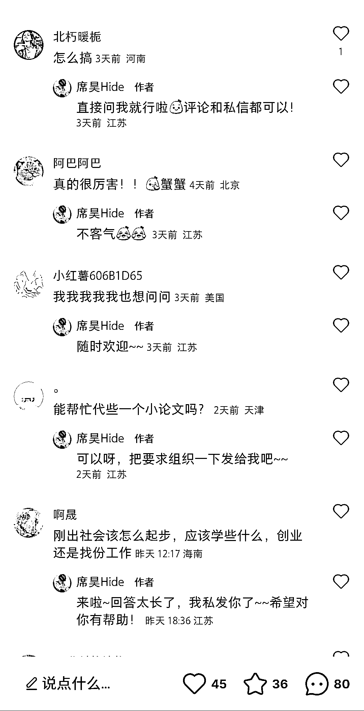

# 小红书 ChatGPT 代问笔记，可引流私域

> 原文：[`www.yuque.com/for_lazy/xkrm14/vzqqc48ft9xmshtg`](https://www.yuque.com/for_lazy/xkrm14/vzqqc48ft9xmshtg)

<ne-p id="u33bc9730" data-lake-id="u33bc9730"><ne-text id="u88e81b49">作者： 彦威</ne-text></ne-p> <ne-p id="uff32f4b8" data-lake-id="uff32f4b8"><ne-text id="uc5401458">日期：2023-03-22</ne-text></ne-p> <ne-p id="u229a9465" data-lake-id="u229a9465"><ne-text id="u2257c134">点赞数：</ne-text><ne-text id="ufca45ec5" ne-bold="true">40</ne-text></ne-p> <ne-hole id="ud85e51c9" data-lake-id="ud85e51c9"><ne-card data-card-name="hr" data-card-type="block" id="WK1Mm" data-event-boundary="card"><ne-p id="uc4c326ff" data-lake-id="uc4c326ff"><ne-text id="uc7613f32">正文：</ne-text></ne-p> <ne-p id="ufdb361ec" data-lake-id="ufdb361ec"><ne-text id="u95d67a9f">ChatGPT 代问</ne-text> <ne-text id="uaa3c2452">有一部分人群听过或见过与 ChatGPT 有关的东西，但由于一些门槛，却没有接触过。那么代问就可以解决他们向 ChatGPT 提问的需求，可以把这部分人群转化到丝域，教他们跨过那个门槛，教他们如何使用 ChatGPT，进行变现。</ne-text></ne-p> <ne-p id="udd78f469" data-lake-id="udd78f469"><ne-card data-card-name="image" data-card-type="inline" id="qOuK9" data-event-boundary="card">  <ne-p id="ua9059164" data-lake-id="ua9059164"><ne-card data-card-name="image" data-card-type="inline" id="vG4po" data-event-boundary="card">  <ne-hole id="u6e508836" data-lake-id="u6e508836"><ne-card data-card-name="hr" data-card-type="block" id="vRcN7" data-event-boundary="card"><ne-p id="u98ce133f" data-lake-id="u98ce133f"><ne-text id="ucf3c3843">评论区：</ne-text></ne-p> <ne-p id="u75bbe7a3" data-lake-id="u75bbe7a3"><ne-text id="u494d5228">蓝色眼镜 : 代问是引流品，若用机器实现，成本大降 课程是利润品，若自己没现成课程，先走 CPS 模式</ne-text></ne-p> <ne-hole id="u3c0a3137" data-lake-id="u3c0a3137"><ne-card data-card-name="hr" data-card-type="block" id="AmGwO" data-event-boundary="card"><ne-p id="u408c1438" data-lake-id="u408c1438"><ne-text id="uf259d395">公众号懒人找资源，懒人专属群分享</ne-text></ne-p></ne-card></ne-hole></ne-card></ne-hole></ne-card></ne-p></ne-card></ne-p></ne-card></ne-hole>