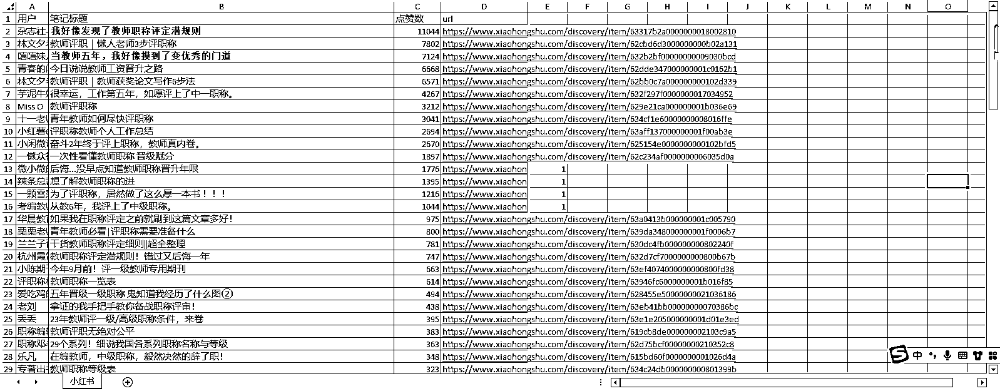
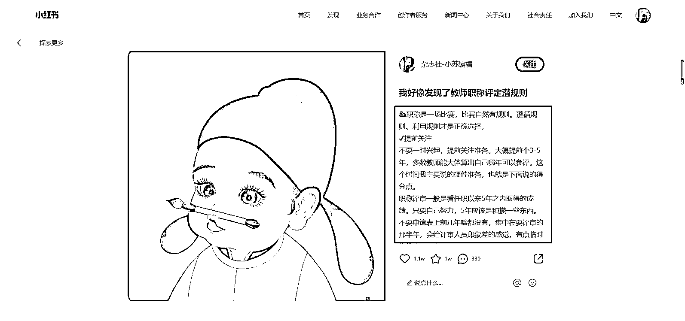
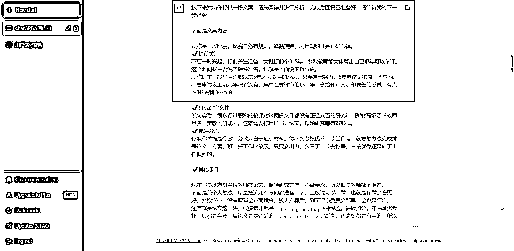

# 小红书两篇引流爆款笔记拆解

> 原文：[`www.yuque.com/for_lazy/xkrm14/ovevtotnaouukgi5`](https://www.yuque.com/for_lazy/xkrm14/ovevtotnaouukgi5)

<ne-p id="uc87b13ef" data-lake-id="uc87b13ef"><ne-text id="ubd57b1e5">作者： 老彭</ne-text></ne-p> <ne-p id="ue64a0fec" data-lake-id="ue64a0fec"><ne-text id="u20b394df">日期：2023-03-22</ne-text></ne-p> <ne-p id="u12d858fc" data-lake-id="u12d858fc"><ne-text id="u88e6dd55">点赞数：</ne-text><ne-text id="u3bf57586" ne-bold="true">49</ne-text></ne-p> <ne-hole id="ue845268b" data-lake-id="ue845268b"><ne-card data-card-name="hr" data-card-type="block" id="ABcom" data-event-boundary="card"><ne-p id="ua586d4da" data-lake-id="ua586d4da"><ne-text id="u6784407a">正文：</ne-text></ne-p> <ne-p id="u80426252" data-lake-id="u80426252"><ne-text id="ub4b4daac">✅像素级拆解自己的两篇引流爆款笔记（图 1），小众领域算爆款，截图时比较早，现在点赞收藏各 100+了。</ne-text> <ne-text id="ua9bdf2f2">方法教给团队小伙伴们，马上也打造出一篇 1000+互动的笔记，在此之前的 7 个月他最高互动也就 200+。（个人感觉可以适用于绝大多数领域） 【文字篇】</ne-text> <ne-text id="u14b719bc">1️⃣寻找领域爆款笔记 以「教师职称」关键词为例，用工具（小红书笔记批量下载软件）提取了这个关键词在小红书的爆款笔记，并按点赞数排序。（图 2）</ne-text> <ne-text id="u48687d70">2️⃣以第一篇爆款「我好像发现了教师职称评定潜规则」为例，直接提取了它的文案，复制（图 3） 3️⃣chatGPT+小红书</ne-text> <ne-text id="ua5b81bd1">接下来我将你提供一段文案，请先阅读并进行分析，完成后回复已准备好，请等待我的下一步指令。下面是文案内容：xxx——爆款文案的复制粘贴（图 4）</ne-text> <ne-text id="u9de3939a">4️⃣用 chatGPT 伪原创爆款文案 请将这段文案，按照小红书的风格，在不改变原意的前提下进行改写，要求有 emoji 表情，字数不少于原文（图 5）</ne-text> <ne-text id="u04a80c8a">5️⃣套用领域数据比较高的标题</ne-text> <ne-text id="ud65b791b">我也试过用 chatGPT 取标题，但效果并不满意，最后还是相信数据（最靠谱），提取了两个合适的标题，第一个是「我好像发现了教师职称评定潜规则」，</ne-text> <ne-text id="ub1e22f72">因为原文是文案标题，所以我直接用于封面标题了，第二个是「当教师五年，我好像摸到了变优秀的门道」，稍微替换关键词用于文案标题。（图 6）</ne-text> <ne-text id="ubd43ec28">✅像素级拆解引流爆款之【图片篇】——（图 7） 1️⃣寻找领域爆款笔记</ne-text> <ne-text id="u2aa63ad4">同上，以这篇「后悔没早点知道教师职称晋升年限」为例，用微信截图直接识别文字，提取文案（图 8）</ne-text> <ne-text id="u1e3e58c5">2️⃣用腾讯文档表格（其他同类软件也行）制作成合集类笔记的封面（最容易出爆款的封面之一），大多数图片类笔记都可以切换成这种风格去展示（图 9）</ne-text> <ne-text id="u50d2d59e">3️⃣chatGPT+小红书 4️⃣用 chatGPT 伪原创爆款文案 5️⃣套用领域数据比较高的标题</ne-text> <ne-text id="u7c37fa3c">剩下的 3-5，同上，就不重复叙述了，不过可以延伸一点，第二种方法可以用 ChatGPT 的精简/阐明/举例的指令，打造出一些纯原创的文案，用于笔记文案里（因为我们不是把主要内容整合进图片了吗，刚好需要一些新的内容）</ne-text> <ne-text id="ufa0be1e7">✅好啦！就这么简简单单就完成一篇爆款选题的笔记制作啦！</ne-text> <ne-text id="uaffbc0bd">（什么时候星球才可以图文并茂地写内容啊....太难了，不知道这么排版，亦仁大大会不会觉得烦就直接跳过了，现在风向标都可以评精华了，我还有点小期待的呢..）</ne-text></ne-p> <ne-p id="u112cca46" data-lake-id="u112cca46"><ne-card data-card-name="image" data-card-type="inline" id="BzLPj" data-event-boundary="card"></ne-card></ne-p> <ne-p id="u2c6b5885" data-lake-id="u2c6b5885"><ne-card data-card-name="image" data-card-type="inline" id="ZyIDW" data-event-boundary="card"></ne-card></ne-p> <ne-p id="u1be26b3a" data-lake-id="u1be26b3a"><ne-card data-card-name="image" data-card-type="inline" id="oDlfd" data-event-boundary="card"></ne-card></ne-p> <ne-p id="u9696eb08" data-lake-id="u9696eb08"><ne-card data-card-name="image" data-card-type="inline" id="NKYAr" data-event-boundary="card"></ne-card></ne-p> <ne-p id="u348e1767" data-lake-id="u348e1767"><ne-card data-card-name="image" data-card-type="inline" id="UmgzJ" data-event-boundary="card"></ne-card></ne-p> <ne-p id="ua8e704a7" data-lake-id="ua8e704a7"><ne-card data-card-name="image" data-card-type="inline" id="nzluQ" data-event-boundary="card"></ne-card></ne-p> <ne-p id="u3ad2049c" data-lake-id="u3ad2049c"><ne-card data-card-name="image" data-card-type="inline" id="aKZpF" data-event-boundary="card"></ne-card></ne-p> <ne-p id="u557f65bd" data-lake-id="u557f65bd"><ne-card data-card-name="image" data-card-type="inline" id="ONzYK" data-event-boundary="card"></ne-card></ne-p> <ne-p id="u3eaaa8cf" data-lake-id="u3eaaa8cf"><ne-card data-card-name="image" data-card-type="inline" id="hz47a" data-event-boundary="card"></ne-card></ne-p> <ne-hole id="u1a2a5c14" data-lake-id="u1a2a5c14"><ne-card data-card-name="hr" data-card-type="block" id="LagHW" data-event-boundary="card"><ne-p id="u0c8ad274" data-lake-id="u0c8ad274"><ne-text id="u329f7f8c">评论区：</ne-text></ne-p> <ne-p id="u271a5fdf" data-lake-id="u271a5fdf"><ne-text id="uafdd29de">追鱼 : 求小红书批量下载笔记</ne-text></ne-p> <ne-p id="udad0fc51" data-lake-id="udad0fc51"><ne-text id="u65e1782b">小伙子 : 精华帖上有批量下载工具</ne-text></ne-p> <ne-p id="ua7385ce0" data-lake-id="ua7385ce0"><ne-text id="u200eafea">📌小攀师兄 : 电脑可以图文一起</ne-text></ne-p> <ne-p id="ud1075318" data-lake-id="ud1075318"><ne-text id="u24c8c5ab">老彭 : 我就是电脑写的呀😭莫非可以直接复制进文本框？</ne-text></ne-p> <ne-p id="u09c39632" data-lake-id="u09c39632"><ne-text id="u1e742706">📌小攀师兄 : 电脑有一个写文章，就像精华帖里面一样的</ne-text></ne-p> <ne-p id="u94e7ccd0" data-lake-id="u94e7ccd0"><ne-text id="uae87641a">老彭 : 最新风向标帖子有写</ne-text></ne-p> <ne-p id="ucc9a0b9b" data-lake-id="ucc9a0b9b"><ne-text id="ub21a6e99">老彭 : 小红书航海资料也有</ne-text></ne-p> <ne-p id="u4e1cce33" data-lake-id="u4e1cce33"><ne-text id="u24017acb">追鱼 : 感谢感谢</ne-text></ne-p> <ne-hole id="u044f3910" data-lake-id="u044f3910"><ne-card data-card-name="hr" data-card-type="block" id="RGm49" data-event-boundary="card"><ne-p id="uc4160307" data-lake-id="uc4160307"><ne-text id="u13216cc7">公众号懒人找资源，懒人专属群分享</ne-text></ne-p></ne-card></ne-hole></ne-card></ne-hole></ne-card></ne-hole>