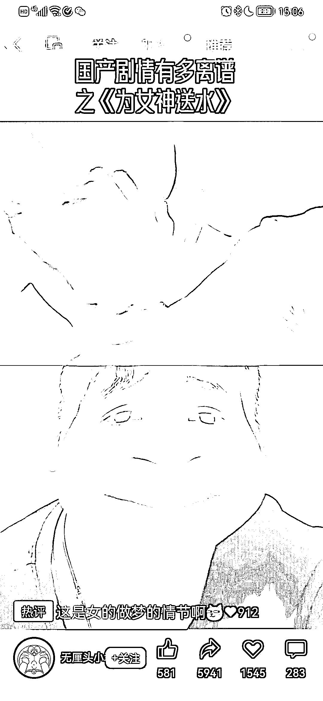

# 视频号，抖音快速起号小技巧

> 原文：[`www.yuque.com/for_lazy/xkrm14/uggvx3uz1gmxg4zy`](https://www.yuque.com/for_lazy/xkrm14/uggvx3uz1gmxg4zy)

<ne-p id="u7d3fc574" data-lake-id="u7d3fc574"><ne-text id="u783fa7ae">作者： 陈龙</ne-text></ne-p> <ne-p id="u40e863ff" data-lake-id="u40e863ff"><ne-text id="u0fcd3a5f">日期：2023-03-22</ne-text></ne-p> <ne-p id="u04029f53" data-lake-id="u04029f53"><ne-text id="udf69620d">点赞数：</ne-text><ne-text id="u0c8a11c8" ne-bold="true">28</ne-text></ne-p> <ne-hole id="u9e76d151" data-lake-id="u9e76d151"><ne-card data-card-name="hr" data-card-type="block" id="WScN8" data-event-boundary="card"><ne-p id="u71f9065e" data-lake-id="u71f9065e"><ne-text id="ub33b001a">正文：</ne-text></ne-p> <ne-p id="u49b1dc8a" data-lake-id="u49b1dc8a"><ne-text id="u0cd715e9">视频号，抖音快速起号小技巧，没有门槛 做一个搞笑的视频，最大的问题就是去重 很多段子都是发过发的 加入自己的画面就可以直接搞定了 一分钟就能搞定一条视频</ne-text> <ne-text id="uaa1077c2">账号起来之后可以卖号，带货 门槛基本上没有 可以批量起号</ne-text></ne-p> <ne-p id="u72051dfe" data-lake-id="u72051dfe"><ne-card data-card-name="image" data-card-type="inline" id="c9BYe" data-event-boundary="card"></ne-card></ne-p> <ne-p id="udfe1af66" data-lake-id="udfe1af66"><ne-card data-card-name="image" data-card-type="inline" id="efU93" data-event-boundary="card"></ne-card></ne-p> <ne-hole id="ucf6c910c" data-lake-id="ucf6c910c"><ne-card data-card-name="hr" data-card-type="block" id="GgyAP" data-event-boundary="card"><ne-p id="u9653fbc0" data-lake-id="u9653fbc0"><ne-text id="u7467a74a">评论区：</ne-text></ne-p> <ne-p id="u055707fc" data-lake-id="u055707fc"><ne-text id="u2f52e1db">暂无评论</ne-text></ne-p> <ne-hole id="u84065abd" data-lake-id="u84065abd"><ne-card data-card-name="hr" data-card-type="block" id="jbsKY" data-event-boundary="card"><ne-p id="u90424c0f" data-lake-id="u90424c0f"><ne-text id="u83181ce0">公众号懒人找资源，懒人专属群分享</ne-text></ne-p></ne-card></ne-hole></ne-card></ne-hole></ne-card></ne-hole>