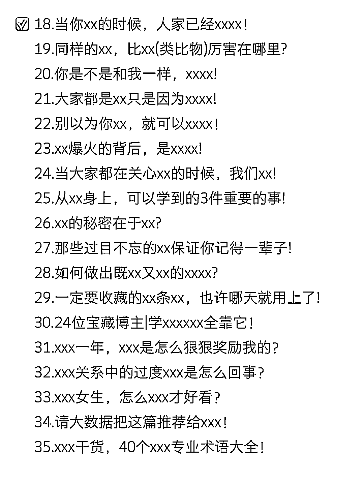
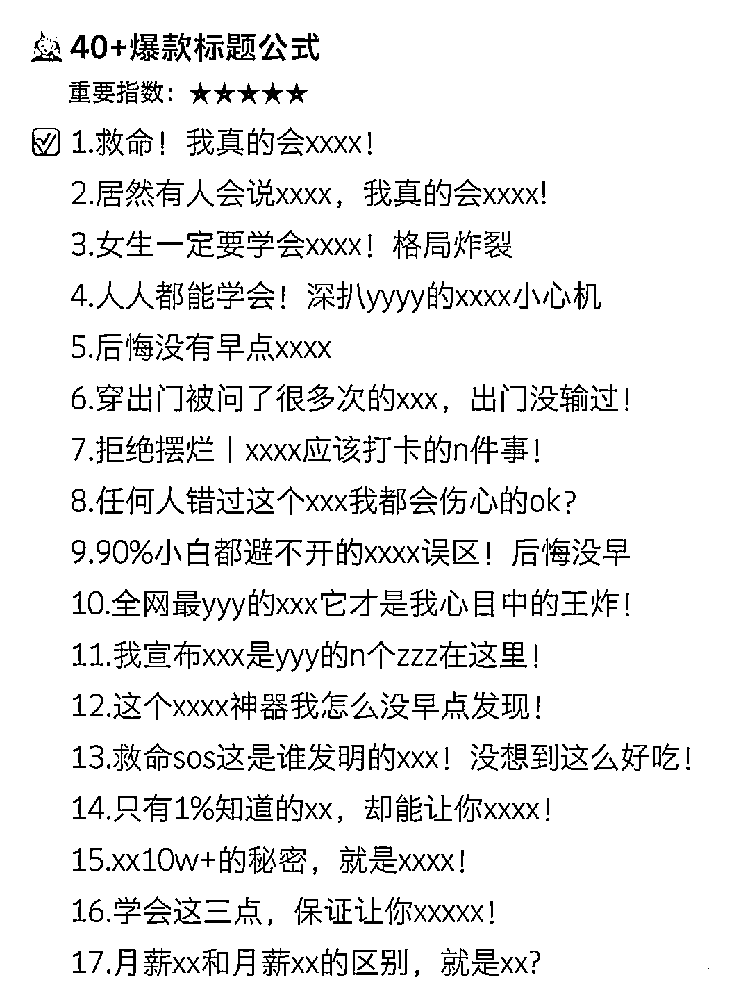

# 小红书，爆款标题密码

> 原文：[`www.yuque.com/for_lazy/xkrm14/hvr94hencut6l2rn`](https://www.yuque.com/for_lazy/xkrm14/hvr94hencut6l2rn)

作者： Leeka

日期：2023-03-22

点赞数：70

<ne-card data-card-name="hr" data-card-type="block" id="ypFz9" data-event-boundary="card">

正文：

小红书，爆款标题密码 上手就能用

<ne-card data-card-name="image" data-card-type="inline" id="POkXU" data-event-boundary="card"></ne-card>

<ne-card data-card-name="image" data-card-type="inline" id="STsbd" data-event-boundary="card"></ne-card>

<ne-card data-card-name="image" data-card-type="inline" id="xalm8" data-event-boundary="card"></ne-card>

<ne-card data-card-name="image" data-card-type="inline" id="h3QGO" data-event-boundary="card"></ne-card>

<ne-card data-card-name="image" data-card-type="inline" id="Vuaf0" data-event-boundary="card"></ne-card>

<ne-card data-card-name="image" data-card-type="inline" id="ExRuL" data-event-boundary="card"></ne-card>

<ne-card data-card-name="hr" data-card-type="block" id="TpBPe" data-event-boundary="card">

评论区：

Superhero : 中标[色]

Leeka : 用这些词作为 prompt 去投喂 GPT 吧😌有奇效

彦威 : 实践过吗？

易博 : 有完整文档么

<ne-card data-card-name="hr" data-card-type="block" id="TaoOC" data-event-boundary="card">

公众号懒人找资源，懒人专属群分享

</ne-card></ne-card></ne-card>