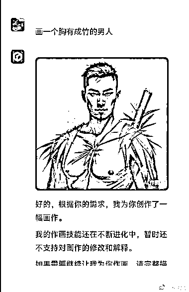
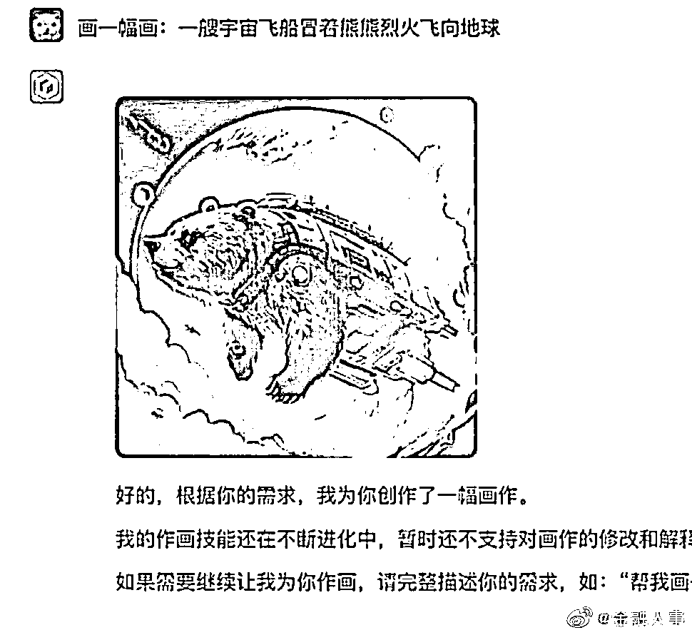
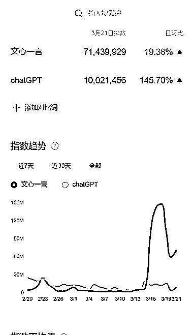

# 小红书可以做吐槽文心生产的内容，热度高，涨粉快

> 原文：[`www.yuque.com/for_lazy/xkrm14/giods65dwgz3t889`](https://www.yuque.com/for_lazy/xkrm14/giods65dwgz3t889)

作者： 林叔

日期：2023-03-22

点赞数：64

正文：

国内都在吐槽文心一言，小红书完全可以开个内容专门吐槽文心生产的内容，比如千里走单骑，陆家嘴这类内容，非常有趣。 目前国内文心一言的热度比 chatGPT 还要高，抓住热点内容，就可以小爆，我公众号写的文心一言的吐槽问，这几天涨粉 800+

  

  

评论区：

💪🏻吉吉积极向上 : 林叔厉害，还是你敏锐

波叔 : 这个确实可以好好利用下[呲牙]

啊海 : 找不到这个软件，这个在哪里下载呢？

林叔 : 这是文心一言，还没开放

ChiefHYK : 哈哈哈，果然是最懂中文的公司

红🐾 : 半夜给我瞌睡笑醒，太有才了叭

张厉害 : 怎么变现。。。

Demi : 笑哭，我可以发个朋友圈吗

公众号懒人找资源，懒人专属群分享

