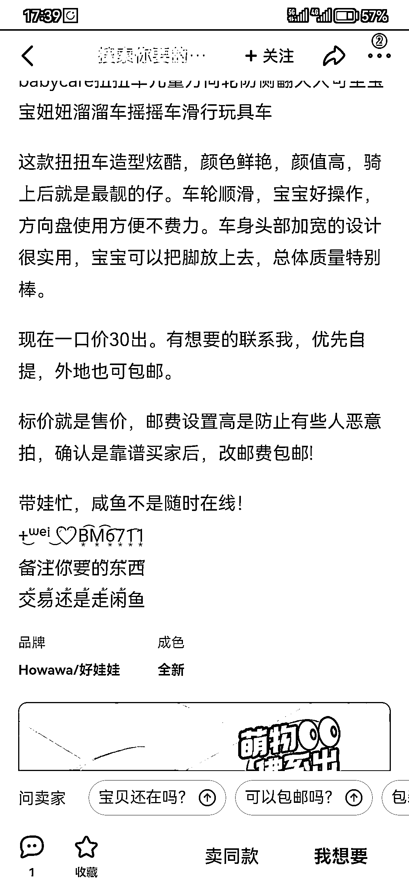

# 闲鱼上引流操作思路分享

> 原文：[`www.yuque.com/for_lazy/xkrm14/mgnh0ldxd0bnhzvv`](https://www.yuque.com/for_lazy/xkrm14/mgnh0ldxd0bnhzvv)

作者： 罗马骁尧

日期：2023-03-21

点赞数：26

<ne-hole id="ud3b71535" data-lake-id="ud3b71535"><ne-card data-card-name="hr" data-card-type="block" id="lj2FS" data-event-boundary="card">

正文：

闲鱼引流，在闲鱼上发布远远低于市场价的物品，引导加微信，然后通知所有物品都已出售，进而拉入群内，有其他低价产品发布，尤其针对母婴产品，效果很好。

<ne-card data-card-name="image" data-card-type="inline" id="WSxKj" data-event-boundary="card">  <ne-p id="ua9593739" data-lake-id="ua9593739"><ne-card data-card-name="image" data-card-type="inline" id="eZIcJ" data-event-boundary="card">  <ne-hole id="u84923232" data-lake-id="u84923232"><ne-card data-card-name="hr" data-card-type="block" id="O8JfC" data-event-boundary="card"><ne-p id="ua2105ee4" data-lake-id="ua2105ee4">评论区：

蛋蛋。 : 这个闲鱼引导加微信好容易被封号哎，有什么好方法么

<ne-hole id="ub55351db" data-lake-id="ub55351db"><ne-card data-card-name="hr" data-card-type="block" id="XR6O0" data-event-boundary="card">

公众号懒人找资源，懒人专属群分享

</ne-card></ne-hole></ne-card></ne-hole></ne-card></ne-p></ne-card></ne-p></ne-card></ne-hole>