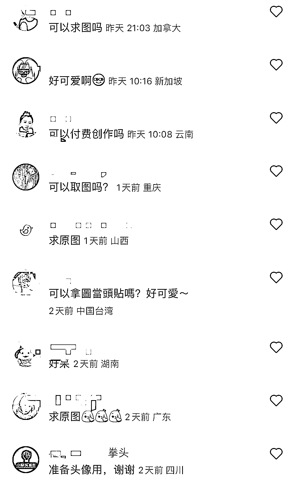

# 小红书宠物粉群体大，AI 绘画宠物赛道可以吸引精准的宠物粉

> 原文：[`www.yuque.com/for_lazy/xkrm14/dzfh9fcitfft5pox`](https://www.yuque.com/for_lazy/xkrm14/dzfh9fcitfft5pox)

<ne-p id="u417f1297" data-lake-id="u417f1297"><ne-text id="uacc45ca1">作者： 筑梦</ne-text></ne-p> <ne-p id="ub7cfeb6e" data-lake-id="ub7cfeb6e"><ne-text id="ufddbcc35">日期：2023-03-21</ne-text></ne-p> <ne-p id="uf89a926a" data-lake-id="uf89a926a"><ne-text id="u82243cd9">点赞数：</ne-text><ne-text id="u98b35b34" ne-bold="true">60</ne-text></ne-p> <ne-hole id="u7330999f" data-lake-id="u7330999f"><ne-card data-card-name="hr" data-card-type="block" id="C9k79" data-event-boundary="card"><ne-p id="u29c4b429" data-lake-id="u29c4b429"><ne-text id="udb434a74">正文：</ne-text></ne-p> <ne-p id="u1f098745" data-lake-id="u1f098745"><ne-text id="u6744ecc9">小红书上宠物粉群体非常大，所以流量一直不错 Ai 绘画宠物赛道可以吸引精准的宠物粉 可通过多种方式引流变现：</ne-text> <ne-text id="uda6cb9ff">1.将想要取图的用户引至公众号，可以为公众号快速涨粉，配合宠物知识类等转化 2.夸克网盘拉新、迅雷拉新等，想要免费取图就要下载（适合各种头像类宠物类账号）</ne-text> <ne-text id="u5f1ea0e0">3.定制宠物头像壁纸等（宠物头像的单价要比人像高很多，宠物头像一般 200+，人像一般 50 左右）</ne-text></ne-p> <ne-p id="u4f183dcb" data-lake-id="u4f183dcb"><ne-card data-card-name="image" data-card-type="inline" id="kNswt" data-event-boundary="card">  <ne-p id="u6831d740" data-lake-id="u6831d740"><ne-card data-card-name="image" data-card-type="inline" id="zMCjQ" data-event-boundary="card">  <ne-hole id="ue5cbbbec" data-lake-id="ue5cbbbec"><ne-card data-card-name="hr" data-card-type="block" id="JoaGP" data-event-boundary="card"><ne-p id="u99a9841d" data-lake-id="u99a9841d"><ne-text id="u379c4e70">评论区：</ne-text></ne-p> <ne-p id="udfe93366" data-lake-id="udfe93366"><ne-text id="uf734d84c">筑梦 : 这个也适合宠物赛道的商家矩阵化运营，再配合后端产品或知识的转化，吸取流量的速度很快且精准。</ne-text></ne-p> <ne-hole id="u4fa24c64" data-lake-id="u4fa24c64"><ne-card data-card-name="hr" data-card-type="block" id="opQkp" data-event-boundary="card"><ne-p id="uaf561b93" data-lake-id="uaf561b93"><ne-text id="u9b9e18a2">公众号懒人找资源，懒人专属群分享</ne-text></ne-p></ne-card></ne-hole></ne-card></ne-hole></ne-card></ne-p></ne-card></ne-p></ne-card></ne-hole>