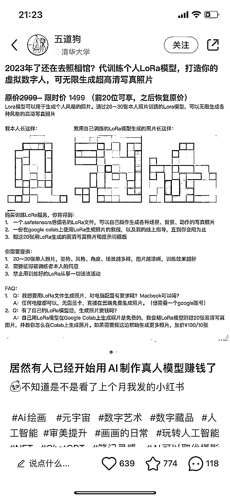

# 小红书利用 LoRa 模型给人“拍写真”

> 原文：[`www.yuque.com/for_lazy/xkrm14/tdv31wcbsfctsotf`](https://www.yuque.com/for_lazy/xkrm14/tdv31wcbsfctsotf)

作者： 方糖呐

日期：2023-03-20

点赞数：26

<ne-card data-card-name="hr" data-card-type="block" id="dsaAu" data-event-boundary="card">

正文：

LoRa 模型除了可以 to B 给商家做 AI 模特， 还可以 to C 给人“拍写真” 这服务有人卖¥1499

<ne-card data-card-name="image" data-card-type="inline" id="bb7IW" data-event-boundary="card">  <ne-card data-card-name="hr" data-card-type="block" id="FVWYi" data-event-boundary="card"><ne-p id="uefbf07cc" data-lake-id="uefbf07cc">评论区：

暂无评论

<ne-card data-card-name="hr" data-card-type="block" id="JtawN" data-event-boundary="card">

公众号懒人找资源，懒人专属群分享

</ne-card></ne-card></ne-card></ne-p></ne-card>