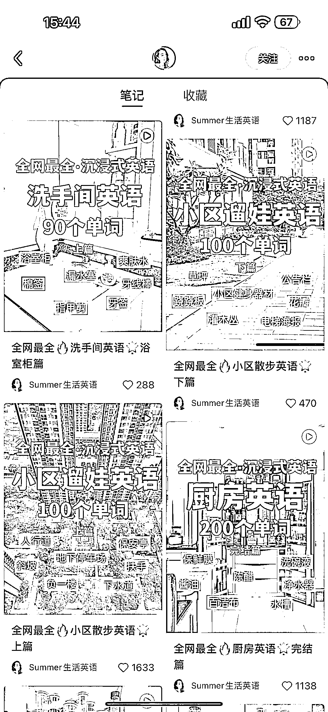
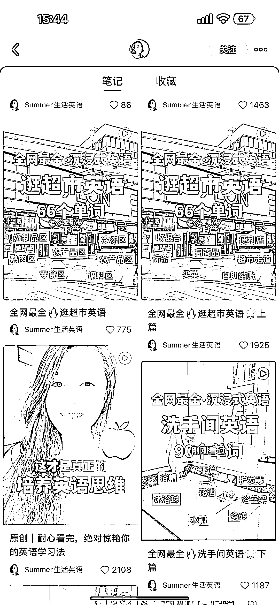
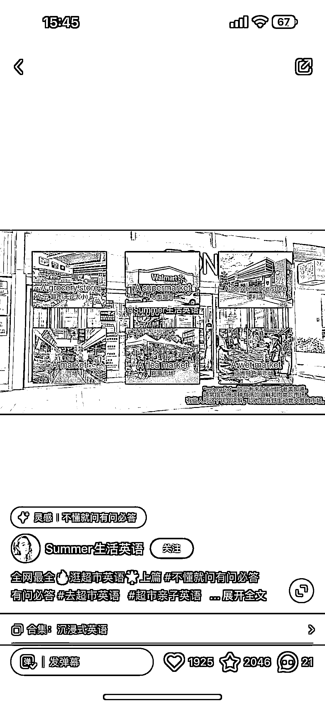
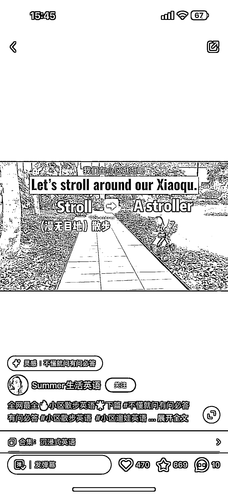

# 小红书上的沉浸式英语学习账号

> 原文：[`www.yuque.com/for_lazy/xkrm14/pzgednd2ht0wgh0f`](https://www.yuque.com/for_lazy/xkrm14/pzgednd2ht0wgh0f)

<ne-p id="u00a38ea2" data-lake-id="u00a38ea2"><ne-text id="ubbb31a97">作者： 斑马森林</ne-text></ne-p> <ne-p id="u26dc69f4" data-lake-id="u26dc69f4"><ne-text id="u27c30466">日期：2023-03-20</ne-text></ne-p> <ne-p id="u1c1c46fb" data-lake-id="u1c1c46fb"><ne-text id="u70faf489">点赞数：</ne-text><ne-text id="u299f3b70" ne-bold="true">15</ne-text></ne-p> <ne-hole id="ua0a48d59" data-lake-id="ua0a48d59"><ne-card data-card-name="hr" data-card-type="block" id="lz1gE" data-event-boundary="card"><ne-p id="u2d180bae" data-lake-id="u2d180bae"><ne-text id="u5b11228c">正文：</ne-text></ne-p> <ne-p id="u80757386" data-lake-id="u80757386"><ne-text id="u634003fa">小红书上的沉浸式英语学习账号 素材来源生活，将生活场景英语化 拍成短视频，配上短语表述，贴近生活 强化记忆，很适合做亲子英语教学的起号模板</ne-text></ne-p> <ne-p id="u1a916e6c" data-lake-id="u1a916e6c"><ne-card data-card-name="image" data-card-type="inline" id="HdNdh" data-event-boundary="card">  <ne-p id="u9a452fba" data-lake-id="u9a452fba"><ne-card data-card-name="image" data-card-type="inline" id="sBYGP" data-event-boundary="card">  <ne-p id="ue73aa72e" data-lake-id="ue73aa72e"><ne-card data-card-name="image" data-card-type="inline" id="WrZcj" data-event-boundary="card">  <ne-p id="ue7bfd709" data-lake-id="ue7bfd709"><ne-card data-card-name="image" data-card-type="inline" id="dtJQk" data-event-boundary="card">  <ne-hole id="u78cb8dfd" data-lake-id="u78cb8dfd"><ne-card data-card-name="hr" data-card-type="block" id="wOuqp" data-event-boundary="card"><ne-p id="ue86d2294" data-lake-id="ue86d2294"><ne-text id="udd06fe35">评论区：</ne-text></ne-p> <ne-p id="u237ff8dc" data-lake-id="u237ff8dc"><ne-text id="u750a009c">暂无评论</ne-text></ne-p> <ne-hole id="uaab96a6d" data-lake-id="uaab96a6d"><ne-card data-card-name="hr" data-card-type="block" id="U51C6" data-event-boundary="card"><ne-p id="ue9980a78" data-lake-id="ue9980a78"><ne-text id="uc9531d5d">公众号懒人找资源，懒人专属群分享</ne-text></ne-p></ne-card></ne-hole></ne-card></ne-hole></ne-card></ne-p></ne-card></ne-p></ne-card></ne-p></ne-card></ne-p></ne-card></ne-hole>