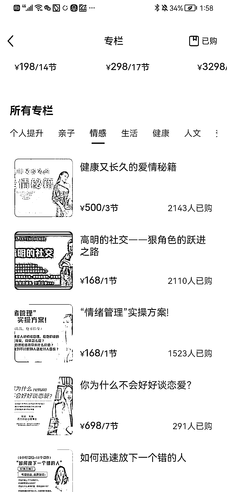
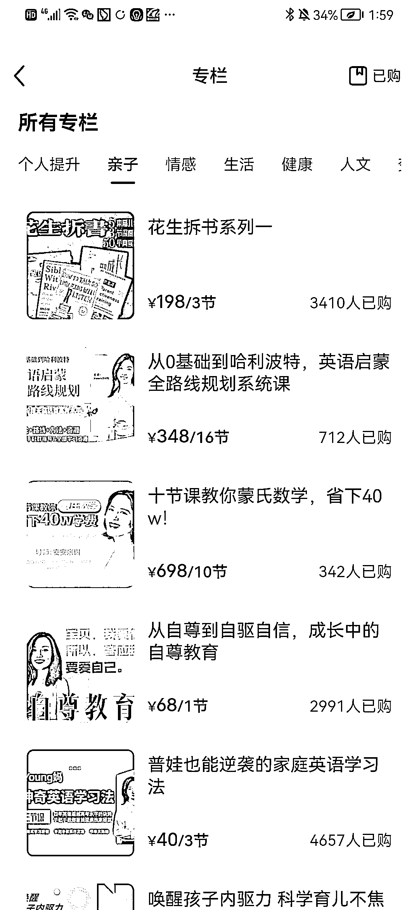

# 小红书专栏的销量,个人提升、亲子、情感类的内容遥遥领先

> 原文：[`www.yuque.com/for_lazy/xkrm14/gn3t3784d83pzbce`](https://www.yuque.com/for_lazy/xkrm14/gn3t3784d83pzbce)

作者： 颜乐乐

日期：2023-03-20

点赞数：12

正文：

小红书专栏的销量。 个人提升、亲子、情感类的内容遥遥领先。销量最好达到 4000 多人。 其他领域的都比较低～ 在内容的选择上，也是可以参考的方向。课程能卖出去，说明这类受众有需求。

  

  

  

  

  

评论区：

暂无评论

公众号懒人找资源，懒人专属群分享

