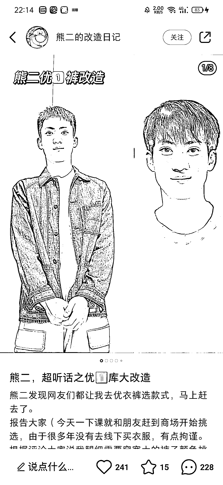
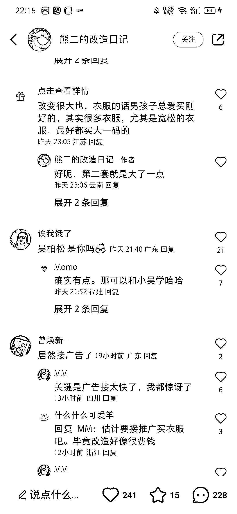

# 小红书穿搭博主起号用求改造文案容易出爆款

> 原文：[`www.yuque.com/for_lazy/xkrm14/mwmzd2ithphrtps2`](https://www.yuque.com/for_lazy/xkrm14/mwmzd2ithphrtps2)

作者： 土豆君

日期：2023-03-20

点赞数：12

<ne-card data-card-name="hr" data-card-type="block" id="fckAo" data-event-boundary="card">

正文：

穿搭博主起号用求改造文案容易出爆款 每个人都有表达的诉求，这样简单的文案就可以吸引到许多的用户评论，容易出爆款笔记。 然后取用户评论接着发形象改造前后对比图笔记，让用户有“养成、追更”的体验，几乎偏偏爆款，直接就可以明目张胆的接广推荐各种品牌服装了。

<ne-card data-card-name="image" data-card-type="inline" id="SHFen" data-event-boundary="card">  <ne-p id="u538e65e3" data-lake-id="u538e65e3"><ne-card data-card-name="image" data-card-type="inline" id="c9rI2" data-event-boundary="card">  <ne-p id="u039f2611" data-lake-id="u039f2611"><ne-card data-card-name="image" data-card-type="inline" id="WcD3i" data-event-boundary="card">  <ne-p id="ue89bddfc" data-lake-id="ue89bddfc"><ne-card data-card-name="image" data-card-type="inline" id="gccsQ" data-event-boundary="card">  <ne-p id="u80cd8410" data-lake-id="u80cd8410"><ne-card data-card-name="image" data-card-type="inline" id="MmEPo" data-event-boundary="card">  <ne-card data-card-name="hr" data-card-type="block" id="FKxbp" data-event-boundary="card"><ne-p id="u6432868c" data-lake-id="u6432868c">评论区：

龚操 : 好聪明的想法 这在男的服装类能出一片天

<ne-card data-card-name="hr" data-card-type="block" id="nlAQi" data-event-boundary="card">

公众号懒人找资源，懒人专属群分享

</ne-card></ne-card></ne-card></ne-p></ne-card></ne-p></ne-card></ne-p></ne-card></ne-p></ne-card></ne-p></ne-card>