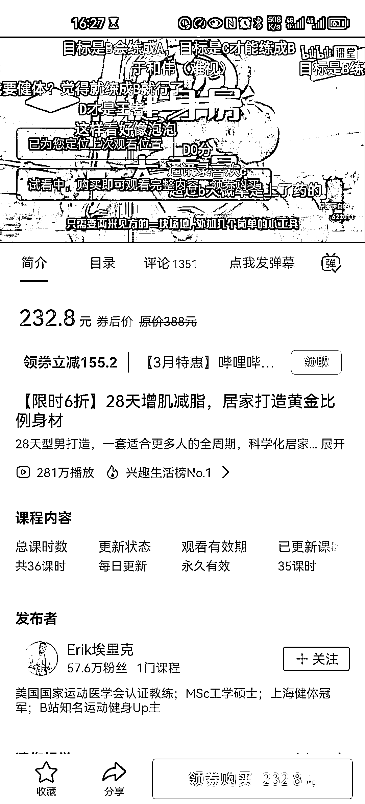

# B 站开通虚拟课程商品功能

> 原文：[`www.yuque.com/for_lazy/xkrm14/eglxbvlza224g3rx`](https://www.yuque.com/for_lazy/xkrm14/eglxbvlza224g3rx)

作者： 高超

日期：2023-03-20

点赞数：10

<ne-hole id="uee407c03" data-lake-id="uee407c03"><ne-card data-card-name="hr" data-card-type="block" id="J8JxW" data-event-boundary="card">

正文：

哔站可以卖课了

<ne-card data-card-name="image" data-card-type="inline" id="mAysJ" data-event-boundary="card">  <ne-hole id="u9c9b6470" data-lake-id="u9c9b6470"><ne-card data-card-name="hr" data-card-type="block" id="U6xqI" data-event-boundary="card"><ne-p id="uce18581e" data-lake-id="uce18581e">评论区：

展望今朝（zhao） : 主要是没有自己的课程，卖其他人的课容易被告侵权[微笑]

<ne-hole id="u79c29353" data-lake-id="u79c29353"><ne-card data-card-name="hr" data-card-type="block" id="raVCn" data-event-boundary="card">

公众号懒人找资源，懒人专属群分享

</ne-card></ne-hole></ne-card></ne-hole></ne-card></ne-p></ne-card></ne-hole>