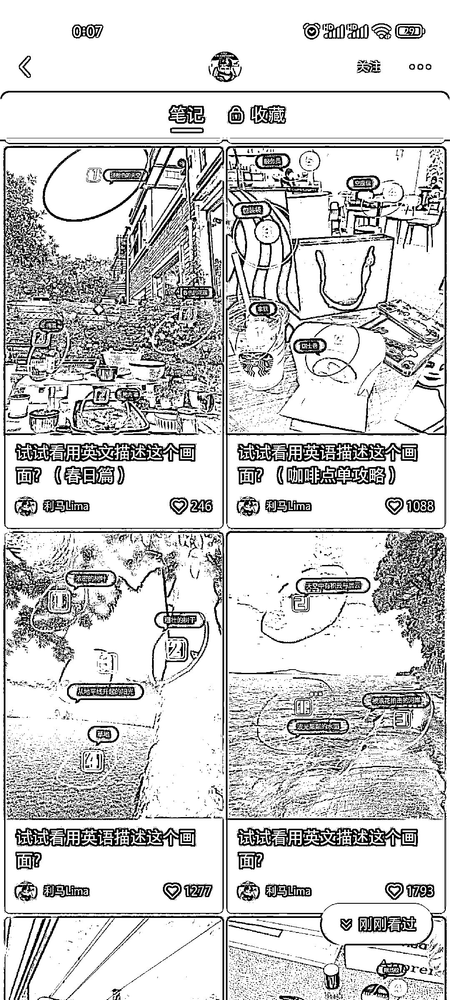
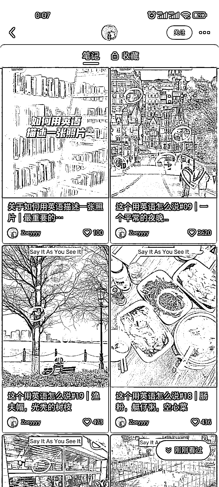

# 小红书英语起号模板

> 原文：[`www.yuque.com/for_lazy/xkrm14/lmf3zfsta0xk1w6q`](https://www.yuque.com/for_lazy/xkrm14/lmf3zfsta0xk1w6q)

作者： 辛禾

日期：2023-03-20

点赞数：20

<ne-card data-card-name="hr" data-card-type="block" id="E7sZW" data-event-boundary="card">

正文：

小红书英语起号模板，观察了几个账号都是刚做不久，用这个图文模板点赞量都很好。同理拍照、绘画也可以这样做

<ne-card data-card-name="image" data-card-type="inline" id="mY3mc" data-event-boundary="card">  <ne-p id="u8d178904" data-lake-id="u8d178904"><ne-card data-card-name="image" data-card-type="inline" id="DbH6b" data-event-boundary="card">  <ne-p id="u6f04ad66" data-lake-id="u6f04ad66"><ne-card data-card-name="image" data-card-type="inline" id="wx5gF" data-event-boundary="card">  <ne-card data-card-name="hr" data-card-type="block" id="TCqWb" data-event-boundary="card"><ne-p id="ud41be2f8" data-lake-id="ud41be2f8">评论区：

暂无评论

<ne-card data-card-name="hr" data-card-type="block" id="AvfcM" data-event-boundary="card">

公众号懒人找资源，懒人专属群分享

</ne-card></ne-card></ne-card></ne-p></ne-card></ne-p></ne-card></ne-p></ne-card>