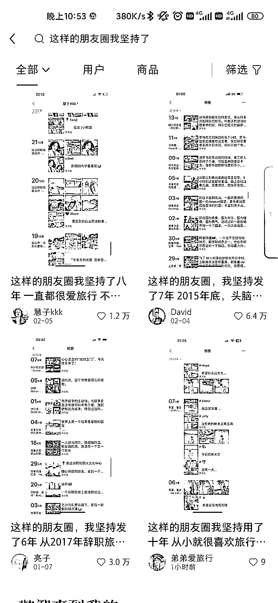
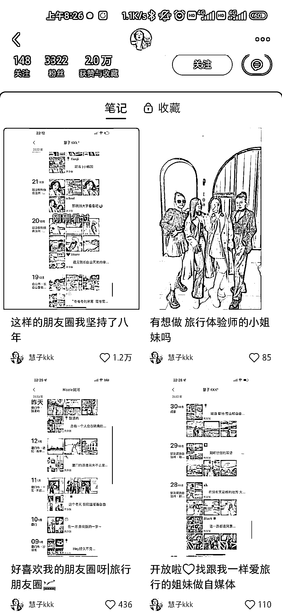

# 小红书朋友圈模板笔记，很适合引流

> 原文：[`www.yuque.com/for_lazy/xkrm14/ikqfwik9y7hcrrbd`](https://www.yuque.com/for_lazy/xkrm14/ikqfwik9y7hcrrbd)

作者： 听雷

日期：2023-03-20

点赞数：14

<ne-card data-card-name="hr" data-card-type="block" id="TaYGx" data-event-boundary="card">

正文：

前面花爷提到旅游业 小红书上“这样的朋友圈我坚持了……” 很适合引流

<ne-card data-card-name="image" data-card-type="inline" id="VdXBe" data-event-boundary="card">  <ne-p id="uf2672928" data-lake-id="uf2672928"><ne-card data-card-name="image" data-card-type="inline" id="aoLiG" data-event-boundary="card">  <ne-p id="u88342250" data-lake-id="u88342250"><ne-card data-card-name="image" data-card-type="inline" id="d142L" data-event-boundary="card">  <ne-p id="u76916338" data-lake-id="u76916338"><ne-card data-card-name="image" data-card-type="inline" id="QBYH3" data-event-boundary="card">  <ne-p id="u51c93255" data-lake-id="u51c93255"><ne-card data-card-name="image" data-card-type="inline" id="TcIRR" data-event-boundary="card">  <ne-card data-card-name="hr" data-card-type="block" id="Amh7W" data-event-boundary="card"><ne-p id="u0f2226c8" data-lake-id="u0f2226c8">评论区：

暂无评论

<ne-card data-card-name="hr" data-card-type="block" id="y8LuD" data-event-boundary="card">

公众号懒人找资源，懒人专属群分享

</ne-card></ne-card></ne-card></ne-p></ne-card></ne-p></ne-card></ne-p></ne-card></ne-p></ne-card></ne-p></ne-card>