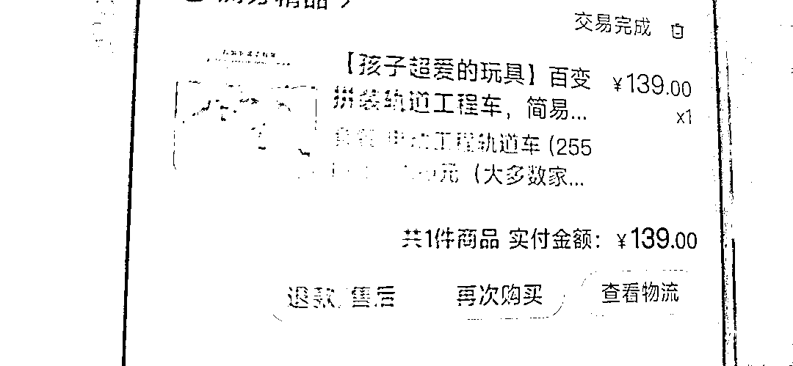
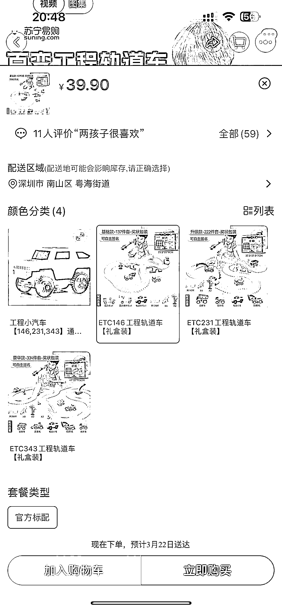

# 有玩具资源的可以去百度小店投放

> 原文：[`www.yuque.com/for_lazy/xkrm14/opo4u5rolw7gcp3q`](https://www.yuque.com/for_lazy/xkrm14/opo4u5rolw7gcp3q)

作者： 姬小光

日期：2023-03-20

点赞数：15

<ne-hole id="u5f9919da" data-lake-id="u5f9919da"><ne-card data-card-name="hr" data-card-type="block" id="rsKRa" data-event-boundary="card">

正文：

老人在老家给我儿子买玩具，几次下来都觉得他们付款金额贵，而实际的东西非常不值得。就问了一下渠道，居然是在百度极速里买的，好奇去看了一下，是百度的小店，应该加了关键词竞价投放，所以价格里包含了一部分广告费用，但是淘宝 39.9 的东西，在百度就能卖 139，这特么老人的钱真是太好赚了吧。有资源的可以尝试下去百度小店投放，大概率这种连货源都没有，搬单代发即可，希望各位老板不要卖太贵哟~

<ne-card data-card-name="image" data-card-type="inline" id="ezjSL" data-event-boundary="card">  <ne-p id="u94e41a53" data-lake-id="u94e41a53"><ne-card data-card-name="image" data-card-type="inline" id="Wt6ji" data-event-boundary="card">  <ne-p id="ua45677ba" data-lake-id="ua45677ba"><ne-card data-card-name="image" data-card-type="inline" id="cAQCN" data-event-boundary="card">  <ne-hole id="ue303d6d1" data-lake-id="ue303d6d1"><ne-card data-card-name="hr" data-card-type="block" id="BbJ8D" data-event-boundary="card"><ne-p id="ud67ccd30" data-lake-id="ud67ccd30">评论区：

烟瑟 : 淘宝 39.9 的东西百度卖 139 可能会亏信不信？有可能广告费就能跑到 100 左右。。。还有退货率太高了

烟瑟 : 以前试过淘宝 99 的产品抖音卖 799，一个月卖了 100 多个，一算账还亏了几千块。。。

<ne-hole id="ubc94ed36" data-lake-id="ubc94ed36"><ne-card data-card-name="hr" data-card-type="block" id="Q2Dw9" data-event-boundary="card">

公众号懒人找资源，懒人专属群分享

</ne-card></ne-hole></ne-card></ne-hole></ne-card></ne-p></ne-card></ne-p></ne-card></ne-p></ne-card></ne-hole>