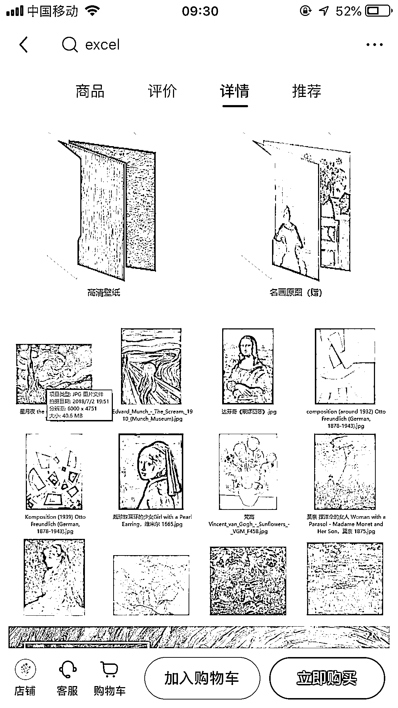

# 小红书手机壁纸整合一下类别，可以打包出售

> 原文：[`www.yuque.com/for_lazy/xkrm14/zgdybpfzyfht61xl`](https://www.yuque.com/for_lazy/xkrm14/zgdybpfzyfht61xl)

作者： 钱劲

日期：2023-03-20

点赞数：14

<ne-card data-card-name="hr" data-card-type="block" id="irKWI" data-event-boundary="card">

正文：

小红书手机壁纸真的很好卖，整合一下类别，可以打包出售，比如风景、动物、猛兽、励志、名画。。。。。每个主题都可以卖

<ne-card data-card-name="image" data-card-type="inline" id="QFFkY" data-event-boundary="card">  <ne-p id="uc58f3806" data-lake-id="uc58f3806"><ne-card data-card-name="image" data-card-type="inline" id="bBLne" data-event-boundary="card">  <ne-card data-card-name="hr" data-card-type="block" id="AH5HW" data-event-boundary="card"><ne-p id="u8a62f61d" data-lake-id="u8a62f61d">评论区：

晓岚 : 如果加上 ai 两个字会不会有更多流量[呲牙]

小张 : 素材他们哪里来的

钱劲 : 网上搜索，自己整理，或者淘宝 PDD 都有卖，买一次，可以卖很多次

<ne-card data-card-name="hr" data-card-type="block" id="pLAUa" data-event-boundary="card">

公众号懒人找资源，懒人专属群分享

</ne-card></ne-card></ne-card></ne-p></ne-card></ne-p></ne-card>