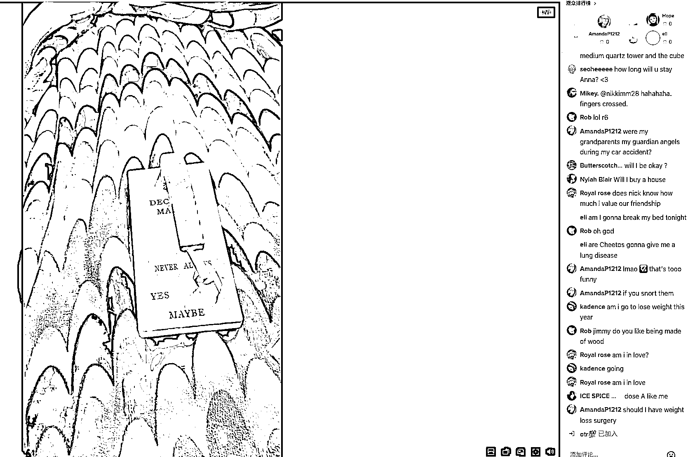

# TikTok 上的“命运决定器”，可以国内直播

> 原文：[`www.yuque.com/for_lazy/xkrm14/lgvpt32akxkdhqlf`](https://www.yuque.com/for_lazy/xkrm14/lgvpt32akxkdhqlf)

<ne-p id="u4f5e9d54" data-lake-id="u4f5e9d54"><ne-text id="uf3d45baa">作者： 孔孔孔孔孔.</ne-text></ne-p> <ne-p id="uf5585f9b" data-lake-id="uf5585f9b"><ne-text id="uc783cda7">日期：2023-03-20</ne-text></ne-p> <ne-p id="ue9373479" data-lake-id="ue9373479"><ne-text id="uc8fbd4f7">点赞数：</ne-text><ne-text id="ufd17de44" ne-bold="true">13</ne-text></ne-p> <ne-hole id="ub7330ede" data-lake-id="ub7330ede"><ne-card data-card-name="hr" data-card-type="block" id="kRett" data-event-boundary="card"><ne-p id="ueb7646d7" data-lake-id="ueb7646d7"><ne-text id="u34f94aae">正文：</ne-text></ne-p> <ne-p id="u77ed25dd" data-lake-id="u77ed25dd"><ne-text id="u362cfb97">Tiktok 上看到一个“命运决定器”，可在国内直播，给个问题然后看结果如何 玩法与答案之书类似，送礼物优先回答</ne-text></ne-p> <ne-p id="uc0af7973" data-lake-id="uc0af7973"><ne-card data-card-name="image" data-card-type="inline" id="C9DTw" data-event-boundary="card"></ne-card></ne-p> <ne-hole id="u1cd9d847" data-lake-id="u1cd9d847"><ne-card data-card-name="hr" data-card-type="block" id="zes7v" data-event-boundary="card"><ne-p id="ua1430fa0" data-lake-id="ua1430fa0"><ne-text id="uad144d76">评论区：</ne-text></ne-p> <ne-p id="u06fba97d" data-lake-id="u06fba97d"><ne-text id="uf3b2bd3f">暂无评论</ne-text></ne-p> <ne-hole id="ud3e56955" data-lake-id="ud3e56955"><ne-card data-card-name="hr" data-card-type="block" id="ibz8R" data-event-boundary="card"><ne-p id="uc1916650" data-lake-id="uc1916650"><ne-text id="ua9de7b87">公众号懒人找资源，懒人专属群分享</ne-text></ne-p></ne-card></ne-hole></ne-card></ne-hole></ne-card></ne-hole>