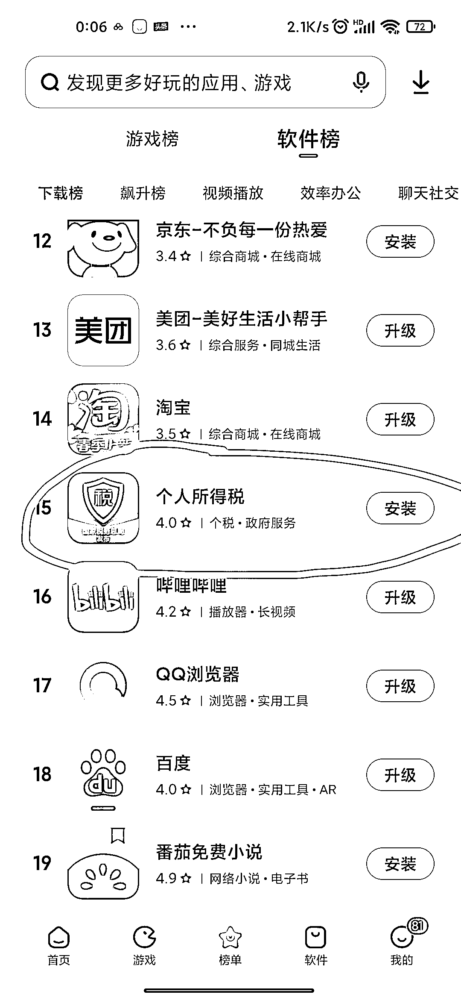
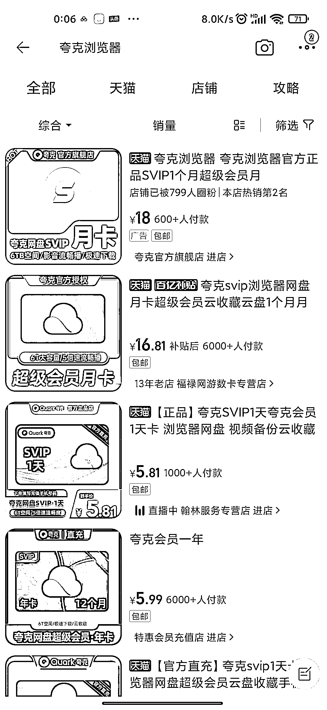

# 可根据软件下载榜或者最新的软件飙升榜，找到可以做的项目

> 原文：[`www.yuque.com/for_lazy/xkrm14/bh5zqo7i9rirwwgi`](https://www.yuque.com/for_lazy/xkrm14/bh5zqo7i9rirwwgi)

<ne-p id="u00e5f7a8" data-lake-id="u00e5f7a8"><ne-text id="uff438714">作者： 阿道无货源店群</ne-text></ne-p> <ne-p id="u68e8ab8f" data-lake-id="u68e8ab8f"><ne-text id="u52341ba1">日期：2023-03-23</ne-text></ne-p> <ne-p id="udd396bbe" data-lake-id="udd396bbe"><ne-text id="uff63024e">点赞数：</ne-text><ne-text id="u15d04a22" ne-bold="true">100</ne-text></ne-p> <ne-hole id="ue5acec71" data-lake-id="ue5acec71"><ne-card data-card-name="hr" data-card-type="block" id="JkbIs" data-event-boundary="card"><ne-p id="u59ce7032" data-lake-id="u59ce7032"><ne-text id="u9b02c982">正文：</ne-text></ne-p> <ne-p id="u000e7848" data-lake-id="u000e7848"><ne-text id="ueae2555c">不知道做什么项目时，可以尝试一下软件下载榜或者最新的软件飙升榜，然后看选择一个软件，打开淘宝搜索这个软件的相关信息，会出来一堆衍生的小生意。</ne-text> <ne-text id="uffb61f15">一定要有跨界思维，除了上面这样子，还可以尝试最近飙升的图书榜，搜索淘宝，最近飙升的热点，搜索公众号，淘宝，最近飙升的热度很高的电视剧电影+淘宝。</ne-text></ne-p> <ne-p id="uc5e800e4" data-lake-id="uc5e800e4"><ne-card data-card-name="image" data-card-type="inline" id="FSrAz" data-event-boundary="card">  <ne-p id="u583d587b" data-lake-id="u583d587b"><ne-card data-card-name="image" data-card-type="inline" id="u9geo" data-event-boundary="card">  <ne-p id="ueb27711e" data-lake-id="ueb27711e"><ne-card data-card-name="image" data-card-type="inline" id="TqyTW" data-event-boundary="card">  <ne-p id="uf5cb808d" data-lake-id="uf5cb808d"><ne-card data-card-name="image" data-card-type="inline" id="H0857" data-event-boundary="card">  <ne-p id="uf9332e4c" data-lake-id="uf9332e4c"><ne-card data-card-name="image" data-card-type="inline" id="o0UnI" data-event-boundary="card">  <ne-hole id="ue7470d5f" data-lake-id="ue7470d5f"><ne-card data-card-name="hr" data-card-type="block" id="kuzrt" data-event-boundary="card"><ne-p id="u73b170f4" data-lake-id="u73b170f4"><ne-text id="u96e156fb">评论区：</ne-text></ne-p> <ne-p id="ubc767285" data-lake-id="ubc767285"><ne-text id="u1047718f">橙丫 : 这个跨界思维很了不起</ne-text></ne-p> <ne-p id="uf5753319" data-lake-id="uf5753319"><ne-text id="u4a840ba3">爱米粒 : 这个好厉害</ne-text></ne-p> <ne-p id="u9e803cbe" data-lake-id="u9e803cbe"><ne-text id="ucb208d5e">张优强 : 这个思路[强][强][强]</ne-text></ne-p> <ne-p id="uf251a9e2" data-lake-id="uf251a9e2"><ne-text id="uf684d080">阿道无货源店群 : 很多东西跨界一结合也会产生很多新产品，这个跨界是寻找思路</ne-text></ne-p> <ne-p id="u6b45470e" data-lake-id="u6b45470e"><ne-text id="u64556045">阿道无货源店群 : [偷笑]</ne-text></ne-p> <ne-p id="u853c07fd" data-lake-id="u853c07fd"><ne-text id="ua517adec">阿道无货源店群 : [玫瑰]</ne-text></ne-p> <ne-p id="u7da82b6a" data-lake-id="u7da82b6a"><ne-text id="u8c3ffc89">猫小鱼🐱 : 这个思路太牛了</ne-text></ne-p> <ne-p id="u0a3df259" data-lake-id="u0a3df259"><ne-text id="u687c1fbb">策马走天涯 : [强][强]</ne-text></ne-p> <ne-hole id="u1b9f5550" data-lake-id="u1b9f5550"><ne-card data-card-name="hr" data-card-type="block" id="sGBYi" data-event-boundary="card"><ne-p id="u49a23808" data-lake-id="u49a23808"><ne-text id="u7f71fe2e">公众号懒人找资源，懒人专属群分享</ne-text></ne-p></ne-card></ne-hole></ne-card></ne-hole></ne-card></ne-p></ne-card></ne-p></ne-card></ne-p></ne-card></ne-p></ne-card></ne-p></ne-card></ne-hole>