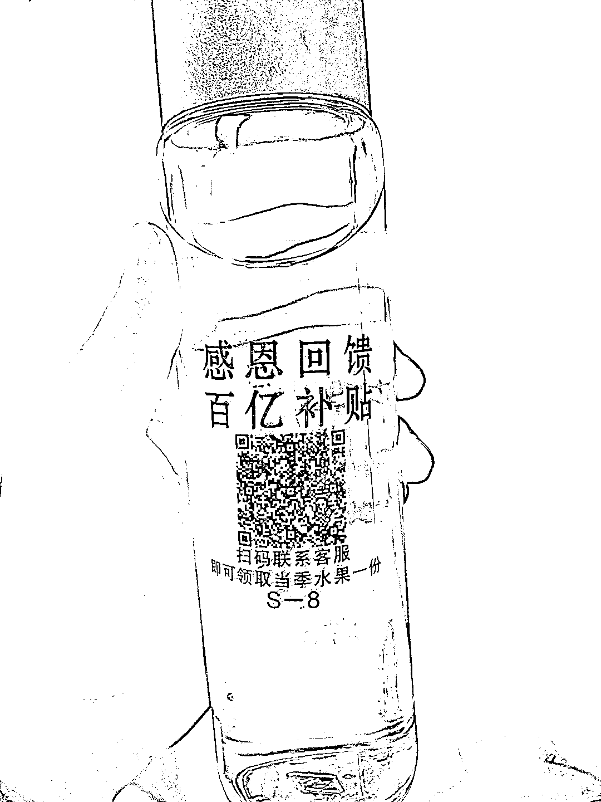
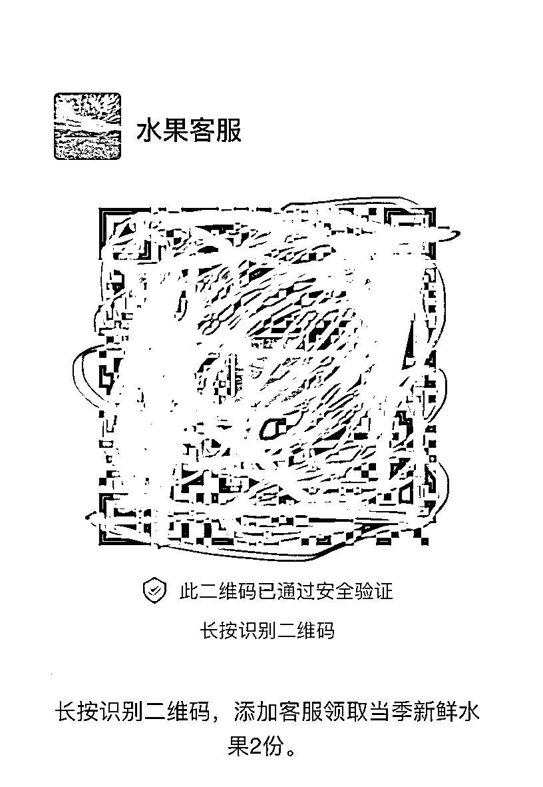
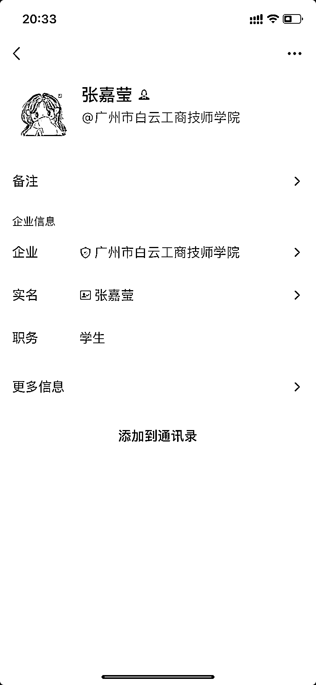

# 免费送礼引流操作思路分享

> 原文：[`www.yuque.com/for_lazy/xkrm14/aotzyrk6doypggp3`](https://www.yuque.com/for_lazy/xkrm14/aotzyrk6doypggp3)

作者： 大头

日期：2023-03-22

点赞数：17

<ne-card data-card-name="hr" data-card-type="block" id="suKNP" data-event-boundary="card">

正文：

今天家人收到一个没买过的快递 拆开是一个玻璃杯，水杯上广告为“扫码联系客服即可获取当季水果一份”，杯子上印有二维码，打开是添加企业微信的二维码，这个套路引流到微信，感觉是一个新的引流方式

<ne-card data-card-name="image" data-card-type="inline" id="mbsqk" data-event-boundary="card">  <ne-p id="u61485f0c" data-lake-id="u61485f0c"><ne-card data-card-name="image" data-card-type="inline" id="cFQtA" data-event-boundary="card">  <ne-p id="u7b3478c8" data-lake-id="u7b3478c8"><ne-card data-card-name="image" data-card-type="inline" id="M6YFR" data-event-boundary="card">  <ne-card data-card-name="hr" data-card-type="block" id="ONdHu" data-event-boundary="card"><ne-p id="uc2151675" data-lake-id="uc2151675">评论区：

潮州痞子蔡 : 可以再走下一步领取水果那步看看对方的变现模式，是快递费还是其它

大头 : 我加了，暂时没通过，好几天了，我想看看来着

戴巍 : 有点意思，如果足够低的话，可能杯子+快递就 5 元以内？获取能有复购的粉丝能打正

大头 : 我也这么想的，我觉得他们应该定向人群的，不是谁都发，可能已经分析了消费能力

兰心 : 我没下单，但收到一个杯子，还没打开，正在想谁寄的[呲牙]

Luke 王子 : 315 老人收音机的 低配版[愉快]

<ne-card data-card-name="hr" data-card-type="block" id="Ve4a4" data-event-boundary="card">

公众号懒人找资源，懒人专属群分享

</ne-card></ne-card></ne-card></ne-p></ne-card></ne-p></ne-card></ne-p></ne-card>