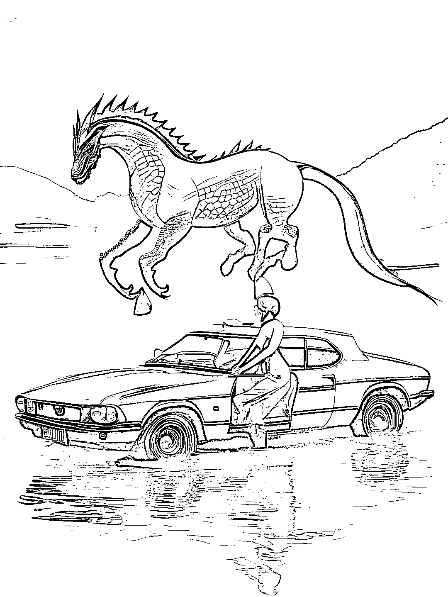
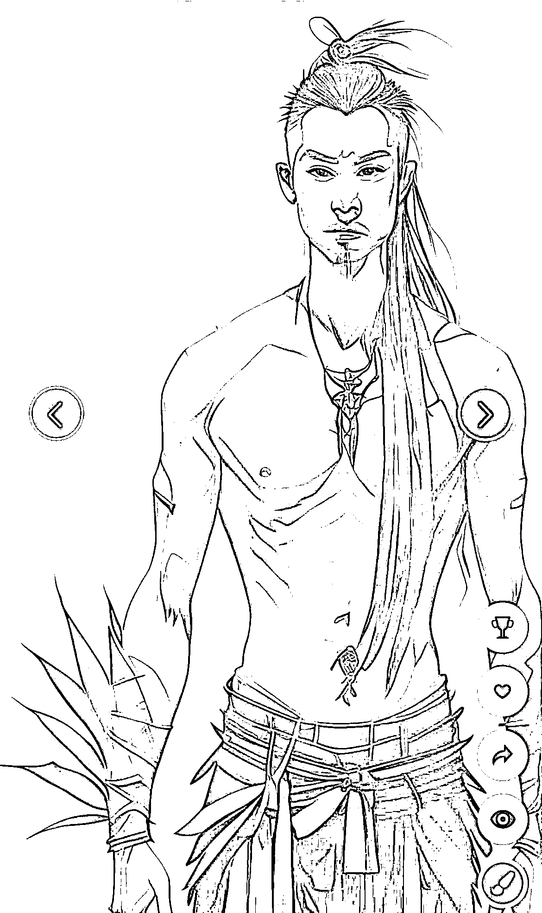

# 逆向思维，利用百度文心一格的智障 AI 图引流互动

> 原文：[`www.yuque.com/for_lazy/xkrm14/ikbyzdivapcuphq5`](https://www.yuque.com/for_lazy/xkrm14/ikbyzdivapcuphq5)

作者： 黄小刀🔪

日期：2023-03-22

点赞数：33

正文：

正向信息：百度文心一格出的 ai 图有点智障，比如以下两张分别是成语“车水马龙”、“胸有成竹”。看到可以笑一笑 逆向思考：是否可以拿这样的图去抖音直播间做“看图猜成语”？直播间流量好拉，同时做休闲小游戏下载……

  

  

评论区：

波叔 : 图二有点儿像一个人的莎士比亚😂

默言 : 不会呀，他是生成这个图片的[撇嘴]

卓桐 : 图二是胸有成竹？

搞钱女孩 : 那你应该也看过，生成的老婆饼，一个老太婆在吃饼[捂脸]

星辰 : 哈哈哈，有意思，是个 good idea

公众号懒人找资源，懒人专属群分享

