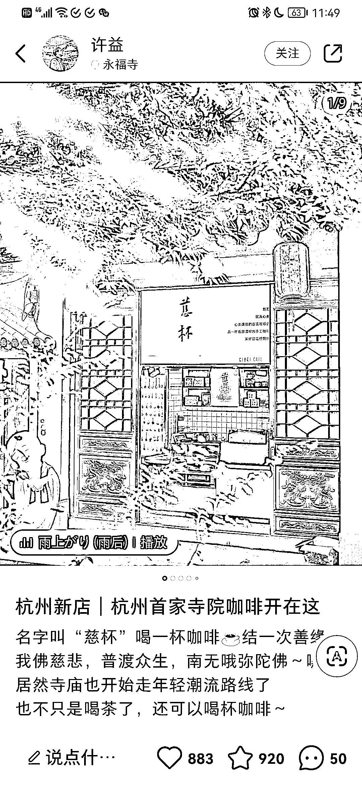
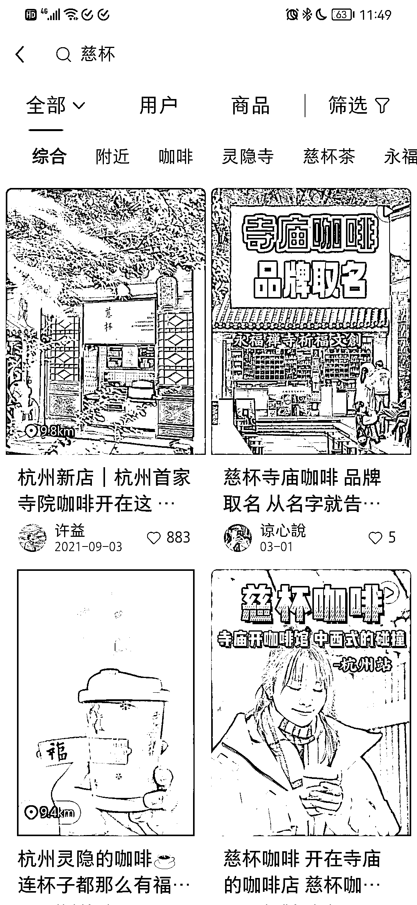

# 寺庙卖咖啡火的原因就是反差感

> 原文：[`www.yuque.com/for_lazy/xkrm14/dl0zg0cam7k44cth`](https://www.yuque.com/for_lazy/xkrm14/dl0zg0cam7k44cth)

作者： 陈龙

日期：2023-03-22

点赞数：49

正文：

慈杯，寺庙卖咖啡 火的原因就是反差感 我们一般觉得佛教都是喝茶的，电视剧也是这样演的 佛教+咖啡，一下子就有反差感了 会觉得很新奇 这是一个非常好的案例，年轻人喝咖啡的比喝茶的多 这就是人口基数大，在互联网项目中就是流量大 这么多年轻人去寺庙拜佛，都有喝点啥的需求 免费的热水，付费的咖啡 觉得有趣还直接发了朋友圈和小红书，全是自来水，不需要去付费推广 这个商业案例很精彩

评论区：

朱胜 : 在花爷星球看过[呲牙]

陈龙 : 是的，前几天我也看到过，然后今天又在小红书刷到了

策马走天涯 : 今天在抖音刷到，今年 2 月份以来，寺庙门票年轻人贡献了一半。 上班和上学之间选择了上香。 求人和求己之间选择了求佛。

卢志敏 : 灵隐寺？感觉灵隐寺里面有互联网大师！[强]

七七 : 北京有同仁堂、内联升开咖啡店。药店+咖啡，鞋店+咖啡。

兰心 : 大理的网红寺庙也有咖啡店☕️[呲牙]

