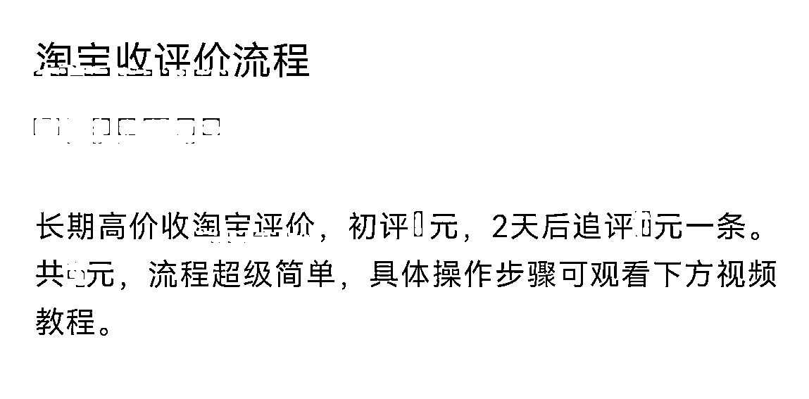

# 淘宝客，月入百万之收评引流玩法

> 原文：[`www.yuque.com/for_lazy/xkrm14/eaw1i432tfeedrxv`](https://www.yuque.com/for_lazy/xkrm14/eaw1i432tfeedrxv)

<ne-p id="uf701df87" data-lake-id="uf701df87"><ne-text id="uada993a0">作者： 霸气哥</ne-text></ne-p> <ne-p id="u16aae73e" data-lake-id="u16aae73e"><ne-text id="ua1463361">日期：2023-03-22</ne-text></ne-p> <ne-p id="ufee72d6c" data-lake-id="ufee72d6c"><ne-text id="u2debdde0">点赞数：</ne-text><ne-text id="u74e399c4" ne-bold="true">28</ne-text></ne-p> <ne-hole id="ue4560132" data-lake-id="ue4560132"><ne-card data-card-name="hr" data-card-type="block" id="vHFUO" data-event-boundary="card"><ne-p id="u2c3b0d04" data-lake-id="u2c3b0d04"><ne-text id="u9cfaf4fb">正文：</ne-text></ne-p> <ne-p id="ua0fb0d4b" data-lake-id="ua0fb0d4b"><ne-text id="u1493d0de">月入百万之收评引 L 玩法</ne-text> <ne-text id="u7d79c181">淘宝评价很多淘客朋友都知道，今天我们分享一个淘宝评价里面的一个分支玩法——收评价。在如今整体用户价值走高的情况下，有不少大佬选择自行引导用户，而收评价引导过来的用户，对淘客来说质量还是很不错的，许多大佬当年通过该玩法达到的月入百万的效果，时至今日，还是很多人在实操，有兴趣的朋友，可以查看这篇分享。</ne-text> <ne-text id="ud02ed379">收评价大致流程为： 找到有进行网购操作的用户，每一个商品都可以进行两条评价，一条是初评，一条是追评。</ne-text> <ne-text id="uc819e217">大部分用户购物后并不会进行评价评星等操作，而这时，就可以将我们带有引流性质的内容，让用户上传至评论区。</ne-text> <ne-text id="uc02112a5">此操作之后，其他未下单的用户浏览商品时，就可以查看到该条评价，就可以实现引流用户。 收评价优势：</ne-text> <ne-text id="u55b50722">1、与收评价用户而言，操作简单，并且可以马上结算，用户体验感强。增进信任之后，也方便日后进行其他操作。</ne-text> <ne-text id="u844356fb">2、购物用户能看到评论区所布置的图片，基本上都是属于未下单的用户，随之会马上被引导至目标账号，目标人群精准。</ne-text> <ne-text id="udb179725">3、购物用户加进来后，大概率会进行下单操作，对我们而言，首单率高。 本期分享到此结束 想要此玩法更多细节，和行业优秀案例，可以找我免费领取。</ne-text></ne-p> <ne-p id="u5e5a383f" data-lake-id="u5e5a383f"><ne-card data-card-name="image" data-card-type="inline" id="imJCe" data-event-boundary="card"></ne-card></ne-p> <ne-p id="uce31fdad" data-lake-id="uce31fdad"><ne-card data-card-name="image" data-card-type="inline" id="F3Z2p" data-event-boundary="card"></ne-card></ne-p> <ne-p id="u3006f6f2" data-lake-id="u3006f6f2"><ne-card data-card-name="image" data-card-type="inline" id="eYspY" data-event-boundary="card"></ne-card></ne-p> <ne-hole id="u76d995c0" data-lake-id="u76d995c0"><ne-card data-card-name="hr" data-card-type="block" id="ISjl7" data-event-boundary="card"><ne-p id="u5f7e8eee" data-lake-id="u5f7e8eee"><ne-text id="u28478a4f">评论区：</ne-text></ne-p> <ne-p id="u92542c6b" data-lake-id="u92542c6b"><ne-text id="ue15c4b85">暂无评论</ne-text></ne-p> <ne-hole id="u333a9241" data-lake-id="u333a9241"><ne-card data-card-name="hr" data-card-type="block" id="APJ8s" data-event-boundary="card"><ne-p id="u70085b77" data-lake-id="u70085b77"><ne-text id="uadabd926">公众号懒人找资源，懒人专属群分享</ne-text></ne-p></ne-card></ne-hole></ne-card></ne-hole></ne-card></ne-hole>