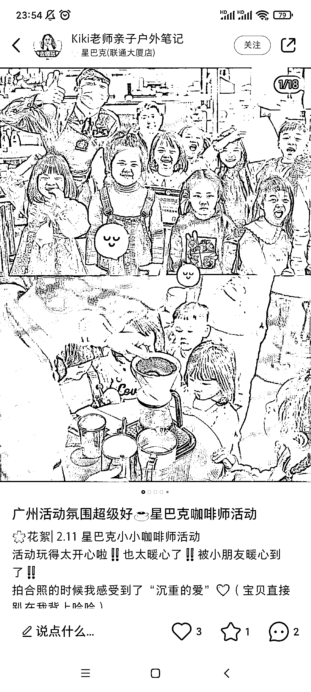
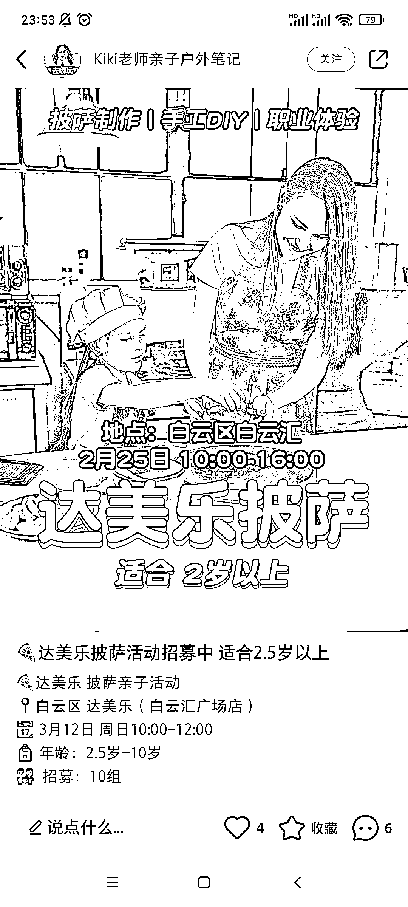
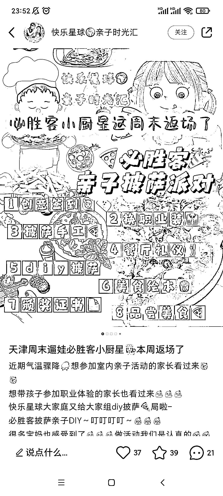
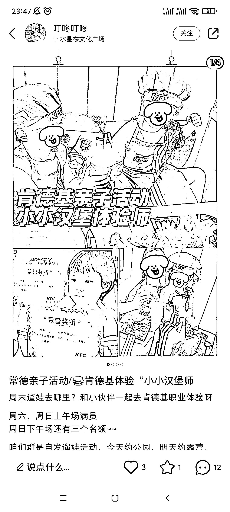

# 亲子活动，借品牌的势能引流

> 原文：[`www.yuque.com/for_lazy/xkrm14/qkp7k906baves2ie`](https://www.yuque.com/for_lazy/xkrm14/qkp7k906baves2ie)

作者： 阿黎

日期：2023-03-22

点赞数：22

正文：

亲子活动，借品牌的势能引流，和品牌的某个店铺进行合作，感觉像是官方活动，提高自己吸引力，同时拍出来的照片，家长喜欢（朋友圈氛围提升价值） 星巴克，必胜客，KFC，汉堡王，麦当劳。。。 各地亲子游账号，都有这样“联名”品牌，借势的操作

评论区：

少儿探索科学实验室 : 我们就经常和肯德基联合搞活动的

阿黎 : 在你风向标小群多分享下，哈哈哈

公众号懒人找资源，懒人专属群分享

