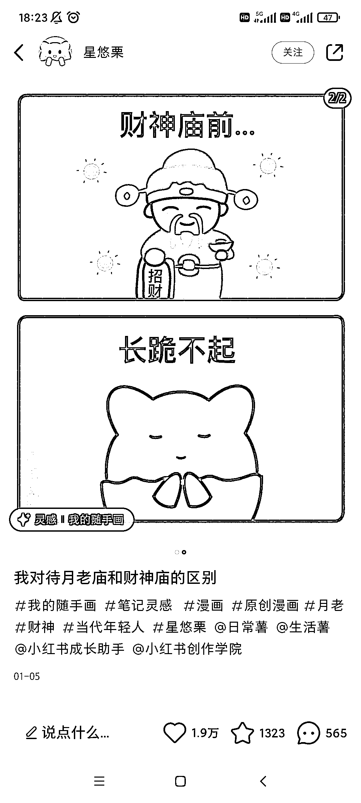
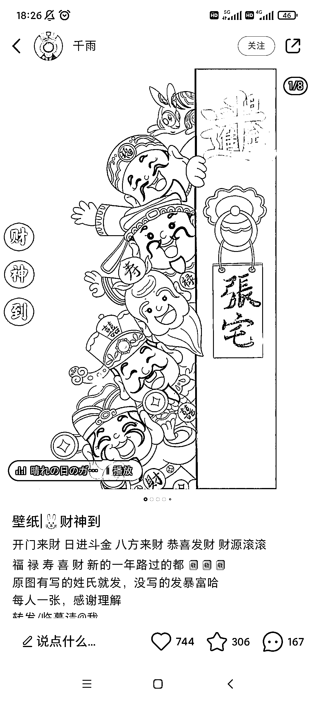
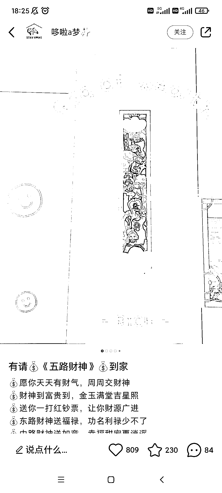
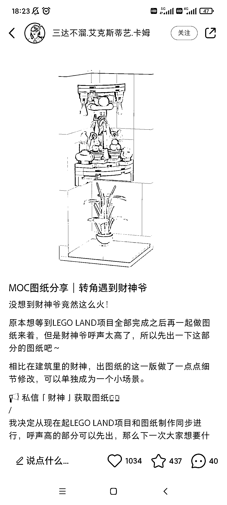

# 产品打造的一个思路：用传统文化、动漫文化中的 IP 发散变现

> 原文：[`www.yuque.com/for_lazy/xkrm14/gaanalug09tbebiz`](https://www.yuque.com/for_lazy/xkrm14/gaanalug09tbebiz)

作者： 阿黎

日期：2023-03-21

点赞数：21

正文：

引流、运营、产品打造的一个思路: 运用传统文化、动漫文化中的 IP，发散，结合具体需求，进行变现，现在更可以用 AIGC 去做 这个是结合大家最近发的，年轻人流行寺庙热，受启发的 以小红书上，财神 ip 应用和变现为例 小红书上，传统文化中的财神，一直是一个很强的 IP 结合用户装饰、社交、家装、玩具、旅游的显性具体需求，以及赚钱的隐性需求 衍生了很多引流、运营、产品设计的思路 1.装饰、社交: 财神漫画、壁纸、贴纸、手机壳 图 1-2 2.家装: 财神玄关画、大门装饰等 图 3-4 3.玩具、文玩: LEGO，文玩摆件 图 5-7 4.旅游: 财神线路、景点等 图 8 5.地推拉新:在商场，遇到穿成财神爷的拉新，给你发个小礼物+传单，你很少拒绝吧 其他各方面都可以延伸 —— 同理可得，月老，孙悟空，白娘子，葫芦娃，威震天，欢乐谷红蛤蟆、卖仔的绿蛤蟆，各方面 IP。。。。。

  

  

评论区：

天启 : 哇！这个好厉害！

阿黎 : 结合自己业务试试😬

天启 : okkk 我去试试

公众号懒人找资源，懒人专属群分享

</ne-p></ne-p>