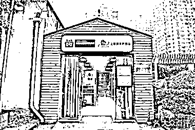

# 养老的方向，可以关注长护险和护理站

> 原文：[`www.yuque.com/for_lazy/xkrm14/bo3toi5dtryc14on`](https://www.yuque.com/for_lazy/xkrm14/bo3toi5dtryc14on)

<ne-p id="ue42c3468" data-lake-id="ue42c3468"><ne-text id="u719527d8">作者： 星辰</ne-text></ne-p> <ne-p id="u516125f0" data-lake-id="u516125f0"><ne-text id="u3b68070a">日期：2023-03-20</ne-text></ne-p> <ne-p id="u1855e437" data-lake-id="u1855e437"><ne-text id="ub96f83e6">点赞数：</ne-text><ne-text id="udd295bf0" ne-bold="true">26</ne-text></ne-p> <ne-hole id="u54f6536a" data-lake-id="u54f6536a"><ne-card data-card-name="hr" data-card-type="block" id="Wo579" data-event-boundary="card"><ne-p id="uf473d9c1" data-lake-id="uf473d9c1"><ne-text id="u05fcc935">正文：</ne-text></ne-p> <ne-p id="u813a42ef" data-lake-id="u813a42ef"><ne-text id="u8fe03683">养老的方向，可以关注长护险和护理站 众所周知，老龄化将是未来中国一个巨大的社会问题。</ne-text> <ne-text id="u933135e0">到目前为止，全国已经有 4000 万以上的失能老人，也就是那种生活完全无法自理的老人。未来这个数字还会持续攀升。怎么解决这一类人的日常生活，是一个很大的社会难题。</ne-text> <ne-text id="u52edbfcf">目前，国家也在逐步引导和补贴养老的项目。如果对养老感兴趣的朋友，可以关注下列两个方向：</ne-text> <ne-text id="ufa4c708b">第一个是【长期护理险】，简称长护险，也就是专门为长期失能老人提供的一种保险制度，目前全国还在试点阶段，大多是一线城市才有，二线城市也只是部分地区覆盖。这属于一个未来可能大行其道，但是目前还是处在萌芽探索阶段的东西。日本等老龄化国家都有。</ne-text> <ne-text id="u48d69923">详细介绍可以点这个链接看看：</ne-text> <ne-text id="u44272651">第二个是【护理站】。目前大多数一线城市都开始陆续出现，据我所知一些落后地区还没有，甚至连那些地方医疗相关从业人员都还不知道有这玩意。</ne-text> <ne-text id="uda832d0b">护理站的外观看上去跟诊所非常的相似（如下图所示），但实际上是一个可以提供护工上门照顾老人、护士上门、或者老人病人到护理站进行简单的诸如换药啊之类的操作的场所。经营护理站有一定的门槛，比如场所有要求，面积有要求，资质有要求，人员要求（比如要护士挂靠）等等。</ne-text> <ne-text id="udb03f954">那么护理站是如何盈利的呢？目前来讲，很多护理站都是靠长护险盈利的，也就是说护理站覆盖范围内，有很多失能老人需要提供照护，那么他们的家属就会去护理站找护工，而护工上门服务之后，由国家的长护险给老人的护理费进行补贴，实际上就相当于保险替老人出钱给了护理站。除此之外，护理站也可以提供类似普通保姆家政等服务。</ne-text> <ne-text id="u8156daca">PS.这个行业有一家做的很大的公司，叫【福寿康】，有红杉资本投入，可以了解下。</ne-text>[<ne-text id="ub9b90c6a">一图读懂：长护险最新政策！家有失能老人怎么办？长护险来帮你！</ne-text>](https://mp.weixin.qq.com/s?__biz=MzA5MzI0Mjc2Ng==&mid=2452435866&idx=1&sn=851449156e6aacb36df373bec320db89&chksm=87b9477bb0cece6d66c16ce931e9a1f24d2f4682453f438e338aeea07caeb3d95522ccbbb6ec#rd)</ne-p> <ne-p id="ub6a9053e" data-lake-id="ub6a9053e"><ne-card data-card-name="image" data-card-type="inline" id="Vtamc" data-event-boundary="card"></ne-card></ne-p> <ne-p id="u7d4091d4" data-lake-id="u7d4091d4"><ne-card data-card-name="image" data-card-type="inline" id="tWHOs" data-event-boundary="card"></ne-card></ne-p> <ne-hole id="uf11f60a1" data-lake-id="uf11f60a1"><ne-card data-card-name="hr" data-card-type="block" id="X5SOx" data-event-boundary="card"><ne-p id="u4b64da15" data-lake-id="u4b64da15"><ne-text id="ue569ed4b">评论区：</ne-text></ne-p> <ne-p id="uaaef2991" data-lake-id="uaaef2991"><ne-text id="u79992d9b">暂无评论</ne-text></ne-p> <ne-hole id="u00b57955" data-lake-id="u00b57955"><ne-card data-card-name="hr" data-card-type="block" id="lb614" data-event-boundary="card"><ne-p id="udd99410b" data-lake-id="udd99410b"><ne-text id="ubc2d66b2">公众号懒人找资源，懒人专属群分享</ne-text></ne-p></ne-card></ne-hole></ne-card></ne-hole></ne-card></ne-hole>