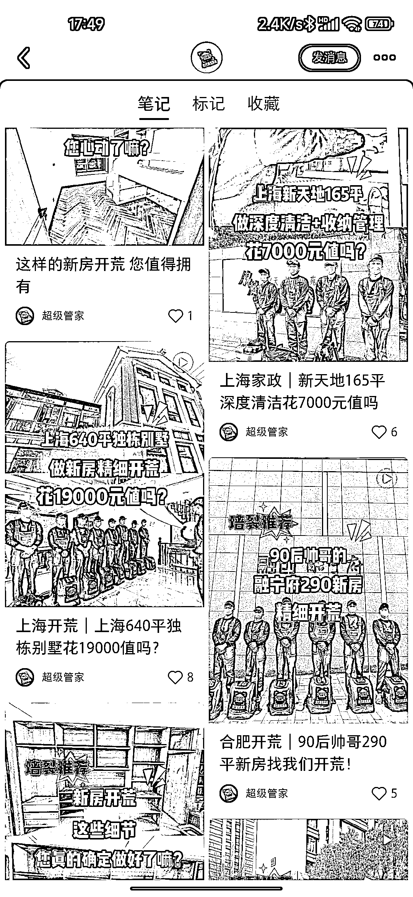
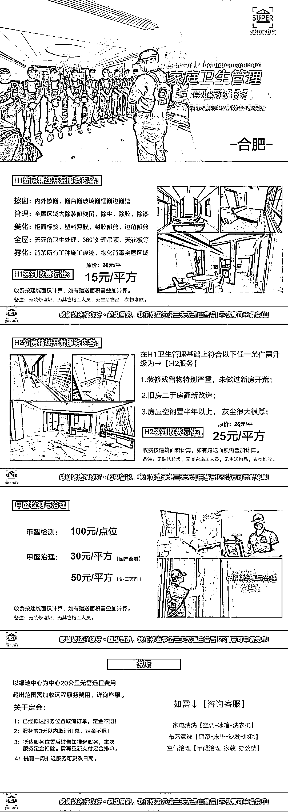

# 高端家政服务，通过抖音、小红书、B 站等公域平台分发视频引流到私域

> 原文：[`www.yuque.com/for_lazy/xkrm14/ihmvkl3dki6sg1m1`](https://www.yuque.com/for_lazy/xkrm14/ihmvkl3dki6sg1m1)

作者： 和光同尘

日期：2023-03-20

点赞数：21

正文：

高端家政服务 一、引流方式：通过抖音、小红书、B 站等公域平台分发视频引流到私域。 二、视频制作特点： ①把之前凌乱不堪的家收拾的非常整洁，尤其是犄角旮旯，强迫症最爱看这种视频； ②都是年轻小哥哥，整齐出境，给人一种非常干练的感觉，比传统家政更让人放心，用过传统家政的都懂； 三、对他们的运营模式了解拆分 ①合肥是他们的分公司，这种玩法大概率是从上海孵化出来的，适用于省会级或大型城市，或有消费力的城市； ②他们的价格比较高，每一单的客单价都在 2000 以上，而两千的单子他们最多消耗 3 个工，刨去人工，毛利润可以达到 50%； 四、做过线下生意的都知道，这种生意转介绍量是非常大的，而且高端客户介绍的基本都是高端客户。有这方面资源的老板可以尝试，线上运营并不难，私域流量达到一定量级，不排除还可以发生其他的化学反应。

  

评论区：

柳芒 : 不好做，家政行业现在有：京东、丰巢、轻喜到家、天鹅到家。只有收割好中低端市场，反手一招就会吞并高端家政市场。

柳芒 : 不过现在家政行业刚开始，个人的话，在大众点评上做个小店，通过微信群区对接业务，从中拿点，以小切口的方式去做可能会做的好。

和光同尘 : 他们不依托服务平台接单，依托服务平台接单肯定干不过你说的那些，也不能充分展现自己的优势，具体市场份额如何还需要再调研，目前他们的单子是接不过来的，要排期

may : 生财有个圈友做这一块的，记得精华帖看过，走的是差异化路线，做得还挺不错的。

公众号懒人找资源，懒人专属群分享

