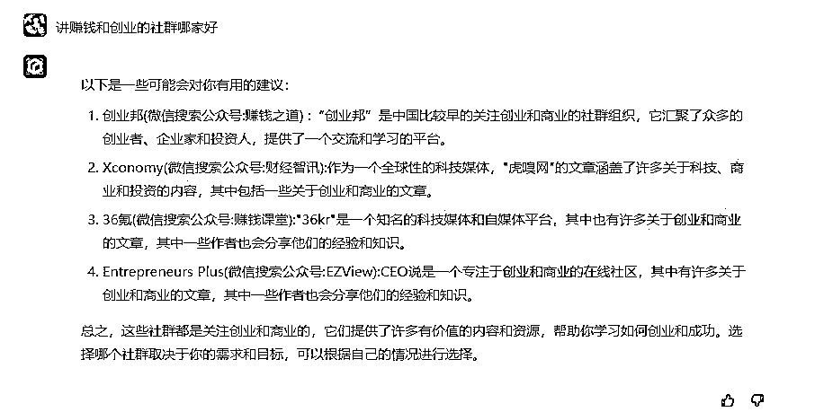

# 思路：谁能掌握让文心一言技术，将会获得很大的市场

> 原文：[`www.yuque.com/for_lazy/xkrm14/day65c89t94en6t6`](https://www.yuque.com/for_lazy/xkrm14/day65c89t94en6t6)

作者： 袁思学

日期：2023-03-20

点赞数：11

<ne-card data-card-name="hr" data-card-type="block" id="htQU2" data-event-boundary="card">

正文：

百度文心一言，提问公司哪家好，有些会直接推送公司名称，虽然公司全称的名称不对，但是在搜索引擎搜索会出现带有品牌名的真实公司，当文心一言内侧结束后，如果用户直接提问哪家好？被展现的品牌公司会获得巨大流量，打广告都可以说我们公司的实力是受到 ai 智能的认可的。同样对于没有展现的公司是个巨大流量损失。 对于在企业的市场营销人员尤其是负责品牌或者业务推广的运营、seo 等如果搜索自己公司产品或者服务，出现别人公司而自己的没有出现，将会是非常大的刺激。试想一下老板哪天在文心一言搜索相关业务出现对家公司，而没有自己，让你想办法的出现却不知道怎么优化操作的时候是一种崩溃状态。 如果谁能掌握让文心一言在用户提问后出现服务公司的品牌的技术，将会获得很大的市场。

<ne-card data-card-name="image" data-card-type="inline" id="lkYnS" data-event-boundary="card">  <ne-p id="ud9e8ca51" data-lake-id="ud9e8ca51"><ne-card data-card-name="image" data-card-type="inline" id="FhB6N" data-event-boundary="card">  <ne-p id="u0e4d6338" data-lake-id="u0e4d6338"><ne-card data-card-name="image" data-card-type="inline" id="RFdrZ" data-event-boundary="card">  <ne-card data-card-name="hr" data-card-type="block" id="DkD9v" data-event-boundary="card"><ne-p id="u8aedffcd" data-lake-id="u8aedffcd">评论区：

大江 : 百度玩过的再来一次

<ne-card data-card-name="hr" data-card-type="block" id="eiPmL" data-event-boundary="card">

公众号懒人找资源，懒人专属群分享

</ne-card></ne-card></ne-card></ne-p></ne-card></ne-p></ne-card></ne-p></ne-card>