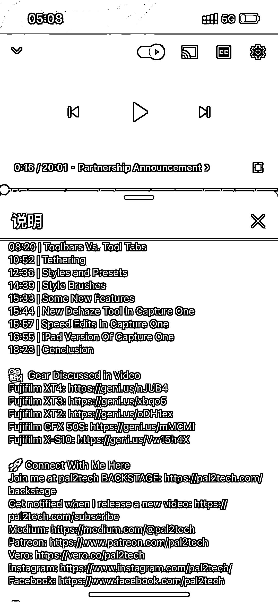

# 虚拟货源找货技巧分享

> 原文：[`www.yuque.com/for_lazy/xkrm14/taztliirpx20oo0u`](https://www.yuque.com/for_lazy/xkrm14/taztliirpx20oo0u)

作者： 小梦

日期：2023-03-20

点赞数：14

<ne-hole id="u8a37d63c" data-lake-id="u8a37d63c"><ne-card data-card-name="hr" data-card-type="block" id="KZlRN" data-event-boundary="card">

正文：

本人做淘宝虚拟，如果想做虚拟的分享一下找货源技巧，谷歌浏览器和 youtube 搜索关键词，就类似于百度和 b 站一样，真的很香，已变现 1w+

<ne-card data-card-name="image" data-card-type="inline" id="KQtmr" data-event-boundary="card">  <ne-hole id="uc400db2f" data-lake-id="uc400db2f"><ne-card data-card-name="hr" data-card-type="block" id="xFiN8" data-event-boundary="card"><ne-p id="ucae828e7" data-lake-id="ucae828e7">评论区：

🇲🇽何一凡 : 预设吗

<ne-hole id="u00a4967e" data-lake-id="u00a4967e"><ne-card data-card-name="hr" data-card-type="block" id="GENwZ" data-event-boundary="card">

公众号懒人找资源，懒人专属群分享

</ne-card></ne-hole></ne-card></ne-hole></ne-card></ne-p></ne-card></ne-hole>