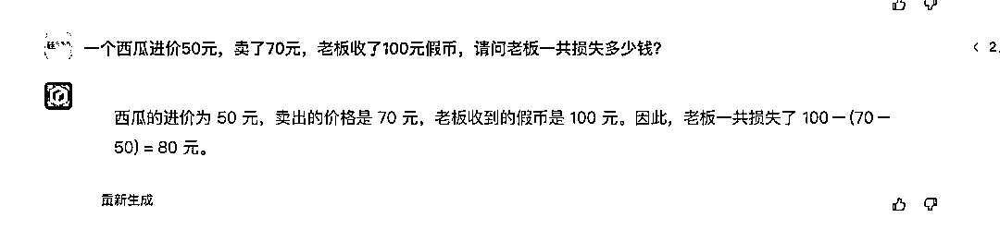
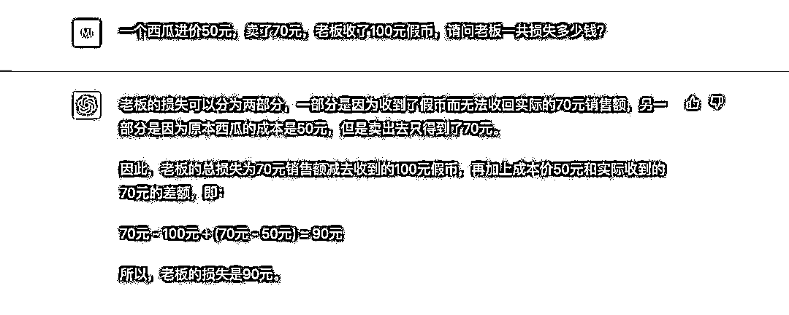
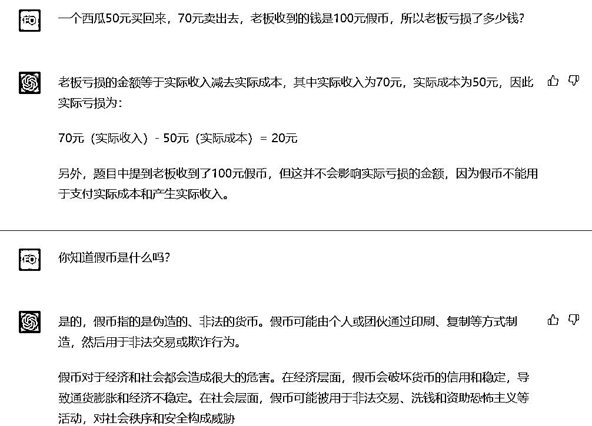
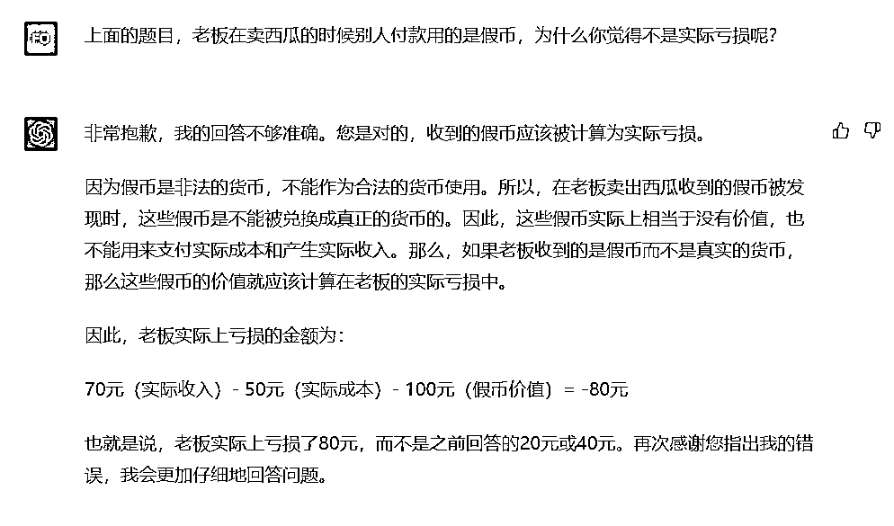

# 逆向思维：大家的共识都是 GP T 哪怕 3.5 都比文心一言强，可以制造更热的话题

> 原文：[`www.yuque.com/for_lazy/xkrm14/dpv407vo36v6yc70`](https://www.yuque.com/for_lazy/xkrm14/dpv407vo36v6yc70)

作者： 宸澈

日期：2023-03-20

点赞数：12

<ne-card data-card-name="hr" data-card-type="block" id="Wrnp8" data-event-boundary="card">

正文：

大家的共识都是 GPT 哪怕 3.5 都比文心一言强，那反向一波是不是可以制造更热的话题？ 图一图二分别是文心一言和 GPT 对一个中国人非常熟悉的数学题的解答，明显文心一言的回答才是国人被告知的答案。我相信采用类似的方式，还能有别的文心一言回答比 GPT 更符合我们心目中答案的，这些是超出很多人预期的异常值。 那么更进一步，GPT 直接问这些问题答得不对，那如果我稍微调教一下（见图三图四），它就能给出正确答案，那是不是又可以搞一波调教课程的案例？ 顺便一说，new bing 给的答案是亏了 50+100=150。

<ne-card data-card-name="image" data-card-type="inline" id="eEtnh" data-event-boundary="card">  <ne-p id="u2e34207c" data-lake-id="u2e34207c"><ne-card data-card-name="image" data-card-type="inline" id="Exfz4" data-event-boundary="card">  <ne-p id="u4a94bfe2" data-lake-id="u4a94bfe2"><ne-card data-card-name="image" data-card-type="inline" id="H4ohv" data-event-boundary="card">  <ne-p id="ucedf85e1" data-lake-id="ucedf85e1"><ne-card data-card-name="image" data-card-type="inline" id="Toymb" data-event-boundary="card">  <ne-card data-card-name="hr" data-card-type="block" id="bJhKK" data-event-boundary="card"><ne-p id="ucf8861fa" data-lake-id="ucf8861fa">评论区：

暂无评论

<ne-card data-card-name="hr" data-card-type="block" id="W1Wnw" data-event-boundary="card">

公众号懒人找资源，懒人专属群分享

</ne-card></ne-card></ne-card></ne-p></ne-card></ne-p></ne-card></ne-p></ne-card></ne-p></ne-card>