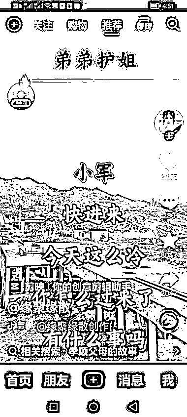

# 做老年人快手，抖音短视频可以考虑这几个方向

> 原文：[`www.yuque.com/for_lazy/xkrm14/zvr7lp8gnhn0zom5`](https://www.yuque.com/for_lazy/xkrm14/zvr7lp8gnhn0zom5)

<ne-p id="u88cb59db" data-lake-id="u88cb59db"><ne-text id="uac2a93e9">作者： 一米七大个</ne-text></ne-p> <ne-p id="u8356ce7a" data-lake-id="u8356ce7a"><ne-text id="u41f8ba5a">日期：2023-03-20</ne-text></ne-p> <ne-p id="udc2ee341" data-lake-id="udc2ee341"><ne-text id="u35e40c6b">点赞数：</ne-text><ne-text id="u7a4df633" ne-bold="true">14</ne-text></ne-p> <ne-hole id="u3833b13a" data-lake-id="u3833b13a"><ne-card data-card-name="hr" data-card-type="block" id="rNhdV" data-event-boundary="card"><ne-p id="ucba89c00" data-lake-id="ucba89c00"><ne-text id="u40eff047">正文：</ne-text></ne-p> <ne-p id="u0ec5aece" data-lake-id="u0ec5aece"><ne-text id="uff8d4a5b">做老年人快手，抖音短视频。 视频基本涉及家庭关系，婆媳矛盾，以及一些民间故事。 内容都比较夸张，矛盾点突出。 视频比较简单，一张夸张的图片+音频就能搞定。</ne-text> <ne-text id="u0e5207cd">做视频的可以考虑下这个方向。</ne-text></ne-p> <ne-p id="u049d2f7f" data-lake-id="u049d2f7f"><ne-card data-card-name="image" data-card-type="inline" id="Jyj5E" data-event-boundary="card">  <ne-p id="u4db3bdc5" data-lake-id="u4db3bdc5"><ne-card data-card-name="image" data-card-type="inline" id="clWE3" data-event-boundary="card">  <ne-p id="u09e25792" data-lake-id="u09e25792"><ne-card data-card-name="image" data-card-type="inline" id="GEc9w" data-event-boundary="card">  <ne-hole id="u30bf12a9" data-lake-id="u30bf12a9"><ne-card data-card-name="hr" data-card-type="block" id="nnb5F" data-event-boundary="card"><ne-p id="u0770f082" data-lake-id="u0770f082"><ne-text id="u3d81245d">评论区：</ne-text></ne-p> <ne-p id="u5adc7462" data-lake-id="u5adc7462"><ne-text id="udd91d558">lydia : 怎么变现</ne-text></ne-p> <ne-p id="u53e1a437" data-lake-id="u53e1a437"><ne-text id="u9f6633bc">一米七大个 : 建议参加视频号的航海，或者看下航海手册</ne-text></ne-p> <ne-p id="u6d67fcb2" data-lake-id="u6d67fcb2"><ne-text id="u400c2a6d">lydia : 我以为除了短剧带货还有别的方向</ne-text></ne-p> <ne-p id="u7da584c0" data-lake-id="u7da584c0"><ne-text id="u26783323">一米七大个 : 有了特定用户群体，后面变现问题，好解决</ne-text></ne-p> <ne-p id="uff973677" data-lake-id="uff973677"><ne-text id="u748f68be">机长⁶⁶⁶ : 怎么找这些快手上的账号？有排行榜么？</ne-text></ne-p> <ne-p id="ubf0ec1a8" data-lake-id="ubf0ec1a8"><ne-text id="ua4bd9c75">一米七大个 : 有个技巧，打开父母的快手，看他们在看什么</ne-text></ne-p> <ne-p id="ue912171d" data-lake-id="ue912171d"><ne-text id="u8d0ef5c5">卓桐 : 再打开父母的拼多多，看他们在买什么哈哈哈</ne-text></ne-p> <ne-hole id="udf9ce12a" data-lake-id="udf9ce12a"><ne-card data-card-name="hr" data-card-type="block" id="Fd9jX" data-event-boundary="card"><ne-p id="u5e6a8364" data-lake-id="u5e6a8364"><ne-text id="u35d6bdf2">公众号懒人找资源，懒人专属群分享</ne-text></ne-p></ne-card></ne-hole></ne-card></ne-hole></ne-card></ne-p></ne-card></ne-p></ne-card></ne-p></ne-card></ne-hole>