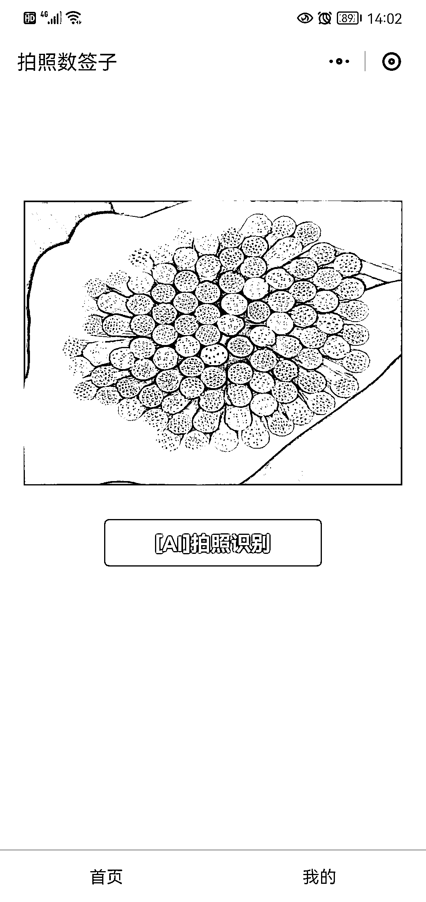
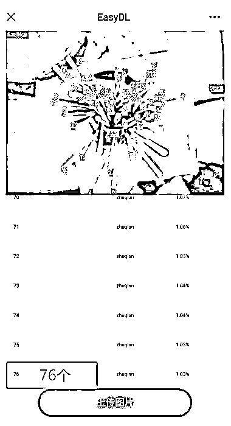

# 撸串数签签微信小程序

> 原文：[`www.yuque.com/for_lazy/xkrm14/mq8suepgam0mz7q0`](https://www.yuque.com/for_lazy/xkrm14/mq8suepgam0mz7q0)

作者： 问逍

日期：2023-03-20

点赞数：14

<ne-hole id="ubefb0b08" data-lake-id="ubefb0b08"><ne-card data-card-name="hr" data-card-type="block" id="EjJea" data-event-boundary="card">

正文：

撸串数签签小程序。 几乎没人没撸过串，每次总是怀疑老板多数，或者称不准（很多店铺签签称重），但是自己又不好意思数一遍，再说几百根也不好数。 那么，做一个微信小程序，拍照识别签签，识别程序可以用百度飞桨 EasyDL（图一），图三是识别效果。 翻了一下，现在微信上面只有一个相关小程序（图二），是今年 3 月 12 日才上线。 变现：可以挂广告、按次收费，给串串店老板免费使用。

<ne-card data-card-name="image" data-card-type="inline" id="IICX7" data-event-boundary="card">  <ne-p id="u23818b58" data-lake-id="u23818b58"><ne-card data-card-name="image" data-card-type="inline" id="UjX3o" data-event-boundary="card">  <ne-p id="ub81deb96" data-lake-id="ub81deb96"><ne-card data-card-name="image" data-card-type="inline" id="ID5pM" data-event-boundary="card">  <ne-hole id="u4baf4904" data-lake-id="u4baf4904"><ne-card data-card-name="hr" data-card-type="block" id="LkhJt" data-event-boundary="card"><ne-p id="ucd6878ae" data-lake-id="ucd6878ae">评论区：

土豆君 : 数签这个，抖音有很多这种视频了，app 有好几款[呲牙]

问逍 : 嗯，小程序还是空白，只有一款刚刚上线的

lalalaLiz : 听说这个不是特别准😂

问逍 : 嗯，只要和老板称的数量误差太大，那么就知道有坑

<ne-hole id="u0fb4f002" data-lake-id="u0fb4f002"><ne-card data-card-name="hr" data-card-type="block" id="fsGZB" data-event-boundary="card">

公众号懒人找资源，懒人专属群分享

</ne-card></ne-hole></ne-card></ne-hole></ne-card></ne-p></ne-card></ne-p></ne-card></ne-p></ne-card></ne-hole>