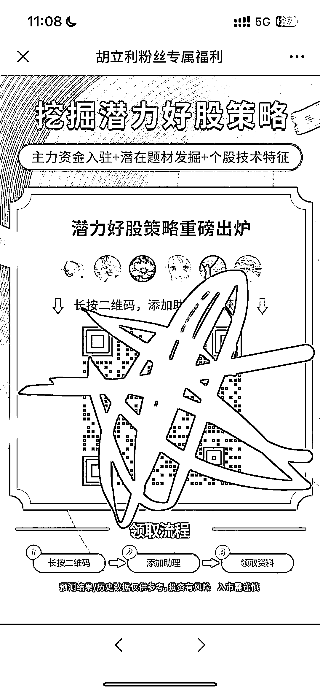

# 朋友圈投放视频号，通过 ChatGPT 的热点来引进私域

> 原文：[`www.yuque.com/for_lazy/xkrm14/wg68gqg1prinol6k`](https://www.yuque.com/for_lazy/xkrm14/wg68gqg1prinol6k)

作者： 📌小攀师兄

日期：2023-03-20

点赞数：11

<ne-hole id="u5a9fce1e" data-lake-id="u5a9fce1e"><ne-card data-card-name="hr" data-card-type="block" id="AuGCe" data-event-boundary="card">

正文：

朋友圈投放视频号，通过 ChatGPT 的热点来引入你进入私域，大概的流程如图！

<ne-card data-card-name="image" data-card-type="inline" id="VbqOU" data-event-boundary="card">  <ne-p id="u62cbc7ce" data-lake-id="u62cbc7ce"><ne-card data-card-name="image" data-card-type="inline" id="IKFIM" data-event-boundary="card">  <ne-p id="u3ae3d652" data-lake-id="u3ae3d652"><ne-card data-card-name="image" data-card-type="inline" id="taXQ7" data-event-boundary="card">  <ne-p id="u8f1aca74" data-lake-id="u8f1aca74"><ne-card data-card-name="image" data-card-type="inline" id="DxEvJ" data-event-boundary="card">  <ne-hole id="u426c9617" data-lake-id="u426c9617"><ne-card data-card-name="hr" data-card-type="block" id="GkyK0" data-event-boundary="card"><ne-p id="ue3cfc035" data-lake-id="ue3cfc035">评论区：

暂无评论

<ne-hole id="u320e06cb" data-lake-id="u320e06cb"><ne-card data-card-name="hr" data-card-type="block" id="NGViL" data-event-boundary="card">

公众号懒人找资源，懒人专属群分享

</ne-card></ne-hole></ne-card></ne-hole></ne-card></ne-p></ne-card></ne-p></ne-card></ne-p></ne-card></ne-p></ne-card></ne-hole>