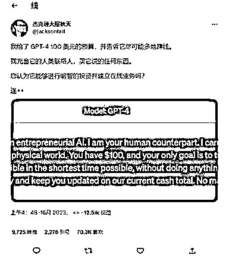

# 给 ChatGPT 100 美元预算，让他给出投资方案

> 原文：[`www.yuque.com/for_lazy/xkrm14/gag51pzqwg7b9pup`](https://www.yuque.com/for_lazy/xkrm14/gag51pzqwg7b9pup)

<ne-p id="ub314d12e" data-lake-id="ub314d12e"><ne-text id="u45227008">作者： AM</ne-text></ne-p> <ne-p id="u0a3862c4" data-lake-id="u0a3862c4"><ne-text id="u8656463b">日期：2023-03-17</ne-text></ne-p> <ne-p id="u98f4fb4a" data-lake-id="u98f4fb4a"><ne-text id="u67074a3f">点赞数：</ne-text><ne-text id="u9d8cebdd" ne-bold="true">150</ne-text></ne-p> <ne-hole id="ufb727de6" data-lake-id="ufb727de6"><ne-card data-card-name="hr" data-card-type="block" id="JUD8e" data-event-boundary="card"><ne-p id="uad3a1397" data-lake-id="uad3a1397"><ne-text id="u1b67a1ff">正文：</ne-text></ne-p> <ne-p id="u78225331" data-lake-id="u78225331"><ne-text id="u1314aec5">如果给 chatGPT100 美元预算，告诉它尽可能地帮你赚钱，你充当它的小助手负责实现它的计划，会发生什么？Twitter 上就有人这么干了...最后现在已经获得 2 万 5000 美元估值…</ne-text></ne-p> <ne-p id="u9d6d0536" data-lake-id="u9d6d0536"><ne-card data-card-name="image" data-card-type="inline" id="dW15o" data-event-boundary="card">  <ne-p id="u972a19eb" data-lake-id="u972a19eb"><ne-card data-card-name="image" data-card-type="inline" id="O3nEY" data-event-boundary="card">  <ne-hole id="u263183f0" data-lake-id="u263183f0"><ne-card data-card-name="hr" data-card-type="block" id="Hf46z" data-event-boundary="card"><ne-p id="uc7f23f1c" data-lake-id="uc7f23f1c"><ne-text id="u9a98ce56">评论区：</ne-text></ne-p> <ne-p id="u5bb5aade" data-lake-id="u5bb5aade"><ne-text id="ua9cb5ea0">少儿探索科学实验室 : 我试了试，可能是我提示的不好，ChatGPT 的回答就很傻</ne-text></ne-p> <ne-p id="u1bfbc248" data-lake-id="u1bfbc248"><ne-text id="u1388e712">AM : [呲牙]首页切换下版本试下</ne-text></ne-p> <ne-p id="u9a8f3046" data-lake-id="u9a8f3046"><ne-text id="u4edc0a7e">少儿探索科学实验室 : 其实这个案例可以给我们更多启发，完全可以做出一个现象级裂变的案例出来，比如以下几个思路：</ne-text> <ne-text id="uebffed26">1、同样用 100 元人民币，小本创业，做一个日记，各种形式，短视频，图文，各种平台宣发，很容易引发转发，围观，裂变，可以组织围观群等等……</ne-text> <ne-text id="ud39e3837">2、给 ChatGPT 一个大额，比如 10 万，真正的去做这个案例，效果又不一样，肯定震撼，10 万元投入，策划的好的话，可是一个地震级别的现象级裂变案例……</ne-text> <ne-text id="u2172d87f">3……更多玩法希望抛砖引玉，大家一起头脑风暴啊</ne-text></ne-p> <ne-p id="u04b195b8" data-lake-id="u04b195b8"><ne-text id="u08c2c44f">AM : 没错 最重要就是还能这样操作的启发 大家一起共创</ne-text></ne-p> <ne-p id="ufcd709a4" data-lake-id="ufcd709a4"><ne-text id="ua4661e6e">狗尾巴草 : 用手上刚做了一个商业活动实践了，真的可以，谢谢分享</ne-text></ne-p> <ne-p id="u22cd88a7" data-lake-id="u22cd88a7"><ne-text id="u9dd9f67a">AM : 执行力厉害了😃</ne-text></ne-p> <ne-p id="u7dbe5b69" data-lake-id="u7dbe5b69"><ne-text id="ude678af0">康松 : 很震撼，吃饭都没心思，就想着去实操</ne-text></ne-p> <ne-p id="ude83fe3f" data-lake-id="ude83fe3f"><ne-text id="ufc8fcea8">鱼 : 感谢分享。受到这条标的启发 今天根据 gpt4 的一步步指示直接上线了 mvp 确实牛</ne-text></ne-p> <ne-hole id="u2974c0b7" data-lake-id="u2974c0b7"><ne-card data-card-name="hr" data-card-type="block" id="iDh3P" data-event-boundary="card"><ne-p id="u8359d5ad" data-lake-id="u8359d5ad"><ne-text id="uaacc8a02">公众号懒人找资源，懒人专属群分享</ne-text></ne-p></ne-card></ne-hole></ne-card></ne-hole></ne-card></ne-p></ne-card></ne-p></ne-card></ne-hole>