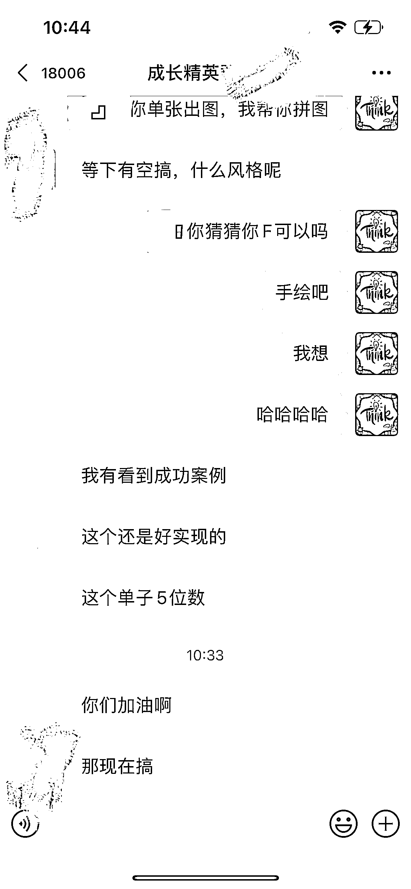

# GPT+MJ 结合，帮设计公司出方案图

> 原文：[`www.yuque.com/for_lazy/xkrm14/chcrzn6ha04qhec0`](https://www.yuque.com/for_lazy/xkrm14/chcrzn6ha04qhec0)

作者： 🐵Sunday🐵

日期：2023-03-16

点赞数：55

正文：

今天我要给大家分享一个我在 Chatgpt 和 Ai 绘画航海中学到的一个小技能，就是是用 gpt➕mj 结合，这种帮设计公司出方案图，给甲方爸爸无限选择，接着定稿了，就给设计师出图，大大减少设计师的工作量。👍 我这段时间就是这样帮朋友接单。费用还不低，而且时间成本相对来讲比较低。🤑 gpt➕mj 是什么呢？其实就是两个人工智能软件的缩写。gpt 是一个可以生成各种文本的软件，比如说标题、简介、文章等等。mj 是一个可以生成各种图片的软件，比如说 logo、海报、插画等等。👏 这两个软件结合起来就可以做到很多神奇的事情。比如说你想给一个品牌做一个 logo，你只需要输入品牌名称和一些关键词，gpt 就会给你生成一些 logo 的描述和建议，然后你再把这些描述输入到 mj 里面，mj 就会给你生成一些 logo 的图片供你选择。👌 同理，如果你想给一个项目做一个方案图，你只需要输入项目名称和一些要求，gpt 就会给你生成一些方案图的描述和建议，然后你再把这些描述输入到 mj 里面，mj 就会给你生成一些方案图的图片供你选择。👍 这样一来，你就不用自己花费很多时间和精力去思考和创作了。而且 gpt➕mj 生成的内容都很有创意和质量，让甲方爸爸看了都觉得满意和惊艳。😍 当然了，并不是说用了 gpt➕mj 就可以完全替代人类设计师了。毕竟人工智能也有它的局限性和缺陷。所以在最后定稿之前还是要请专业的设计师进行修改和优化才行。但是用了 gpt➕mj 之后可以大大减少设计师的工作量和压力，并且提高效率和质量。🙌

  

  

  

评论区：

茶叶蛋 : 可能方法大家都知道，就是缺这样的朋友

🐵Sunday🐵 : 来，一起做朋友

出海 SEO 孔明 : 图片里面的文字也可以用 mj 生成？

🐵Sunday🐵 : 他是自动生成

晓光 : 再也不怕甲方刁难了，来多次都不怕

公众号懒人找资源，懒人专属群分享

</ne-p></ne-p></ne-p>