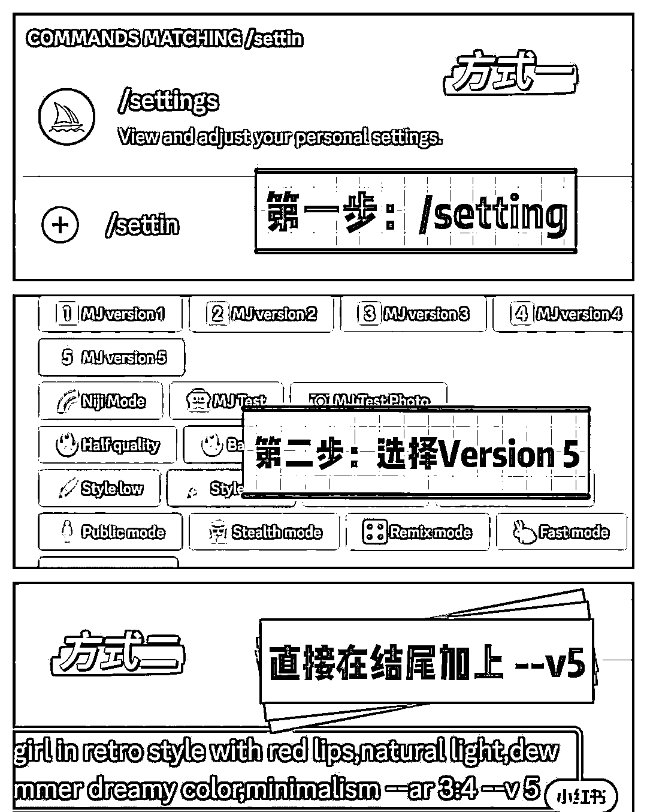

# Midjourney V5 体验分享

> 原文：[`www.yuque.com/for_lazy/xkrm14/zttgsvuyp2od9y75`](https://www.yuque.com/for_lazy/xkrm14/zttgsvuyp2od9y75)

<ne-p id="u36b64324" data-lake-id="u36b64324"><ne-text id="u9627f3fa">作者： 行者</ne-text></ne-p> <ne-p id="u342da0fb" data-lake-id="u342da0fb"><ne-text id="ubf71c187">日期：2023-03-16</ne-text></ne-p> <ne-p id="ufed2fb93" data-lake-id="ufed2fb93"><ne-text id="u2636a39c">点赞数：</ne-text><ne-text id="uc3bbfa10" ne-bold="true">38</ne-text></ne-p> <ne-hole id="u73085bcf" data-lake-id="u73085bcf"><ne-card data-card-name="hr" data-card-type="block" id="uo56n" data-event-boundary="card"><ne-p id="u56e7c0d3" data-lake-id="u56e7c0d3"><ne-text id="uef6688d8">正文：</ne-text></ne-p> <ne-p id="u9e2ff7ff" data-lake-id="u9e2ff7ff"><ne-text id="u57064c28">Midjourney V5 体验 体验有感： 1.Ai 不会画手的问题得到了很大程度的解决了 2.V5 输出的图片更细腻 效果更好了 Midjourney V5</ne-text> <ne-text id="u331512c5">可以正式使用啦 💡两种开启方式 ①【默认开启】输入/setting，开启默认 V5（每次使用会有自动后缀--v 5） ②【手动开启】直接在描述词尾加上 --v</ne-text> <ne-text id="ub753652b">5 V5 新特性 1\. 风格范围更广，对提示的反应更灵敏 2\. 图像质量高得多（分辨率提高 2 倍），动态范围得到了改善 3.</ne-text> <ne-text id="ub0d41707">图像更细致，细节更有可能是正确的；输入更少的不想出现的文本 4\. 改进了图像提示的性能 5\. 支持--tile 参数，用于无缝拼接（处于实验中） 6.</ne-text> <ne-text id="u8c0d787d">支持--ar 长宽比大于 2:1（处于实验中） 7\. 支持--iw，以权衡图像提示与文本提示的关系</ne-text></ne-p> <ne-p id="u0288723f" data-lake-id="u0288723f"><ne-card data-card-name="image" data-card-type="inline" id="ZzMPX" data-event-boundary="card">  <ne-p id="u6cddc0d2" data-lake-id="u6cddc0d2"><ne-card data-card-name="image" data-card-type="inline" id="IdOl5" data-event-boundary="card">  <ne-p id="uef608413" data-lake-id="uef608413"><ne-card data-card-name="image" data-card-type="inline" id="T8RWx" data-event-boundary="card">  <ne-hole id="u099d2246" data-lake-id="u099d2246"><ne-card data-card-name="hr" data-card-type="block" id="WhPpx" data-event-boundary="card"><ne-p id="u1d13035c" data-lake-id="u1d13035c"><ne-text id="u8ee26055">评论区：</ne-text></ne-p> <ne-p id="uc409c001" data-lake-id="uc409c001"><ne-text id="u73eb6d00">感恩学习相信-小陶 : 谢谢分享</ne-text></ne-p> <ne-p id="u1c134494" data-lake-id="u1c134494"><ne-text id="u57ada8ab">Luke 王子 : 感谢分享！</ne-text></ne-p> <ne-hole id="u8acfd200" data-lake-id="u8acfd200"><ne-card data-card-name="hr" data-card-type="block" id="dM5lu" data-event-boundary="card"><ne-p id="u6184f389" data-lake-id="u6184f389"><ne-text id="uaed2019b">公众号懒人找资源，懒人专属群分享</ne-text></ne-p></ne-card></ne-hole></ne-card></ne-hole></ne-card></ne-p></ne-card></ne-p></ne-card></ne-p></ne-card></ne-hole>