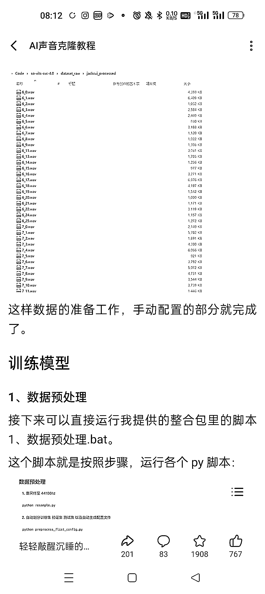
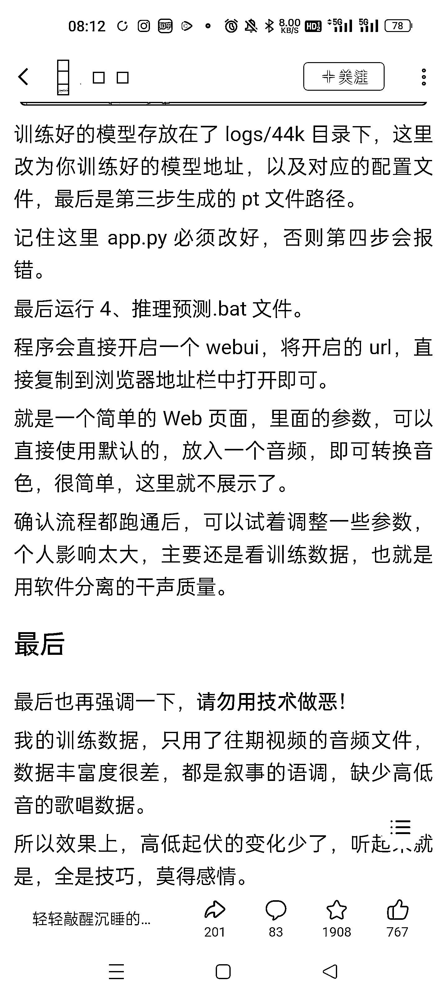

# AIGC，变现思路分享

> 原文：[`www.yuque.com/for_lazy/xkrm14/daatn6d16vikbix3`](https://www.yuque.com/for_lazy/xkrm14/daatn6d16vikbix3)

作者： 施霖终生学习者-链接

日期：2023-03-16

点赞数：25

正文：

关于 AI 克隆声音 之前有发过风向标， 昨天看到 B 站上有算法大佬， 分享了具体教程， AIGC 的火爆， 可以考虑用这个技术做几个事情， 供参考， 1.直播教学，收徒 2.搭建训练模型服务，生成专属声音包 3.用不同的声音模型去替换原来的经典声音或者电影，带来新的创意内容 4.生成内容做音频平台内容，做短视频内容，做中视频配音内容，做音乐号内容，总之可以做的比较多 5.之前有看到抖音有直播声音简评的，通过刷礼物，获得与主播连麦的机会，然后阅读一段文字，一般是一首诗，然后主播根据几个不同的纬度，给音色评分和建议，类似这样关于声音服务的，都可以试试， 祝生财有术啊，

  

  

  

  

  

  

评论区：

王大诗 : 牛哇牛哇 解决了老夫批量的卡点[憨笑]

施霖终生学习者-链接 : 祝您出爆款，生财有术，

施霖终生学习者-链接 : 谢谢亦仁大佬，生财有术，

公众号懒人找资源，懒人专属群分享

</ne-p></ne-p></ne-p></ne-p></ne-p></ne-p>